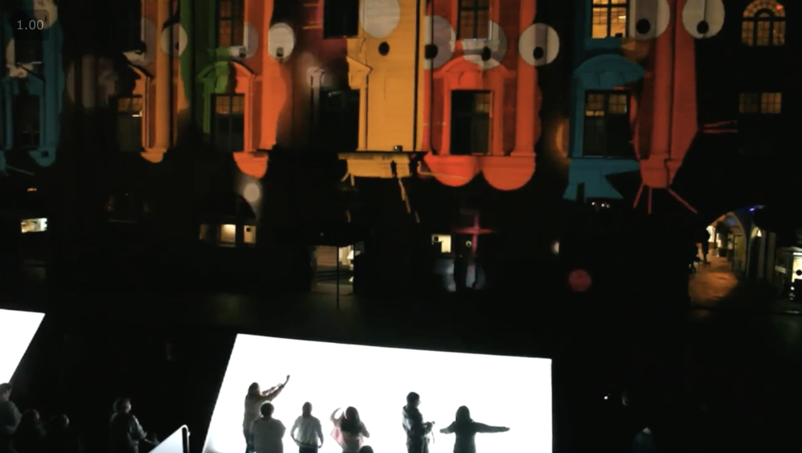
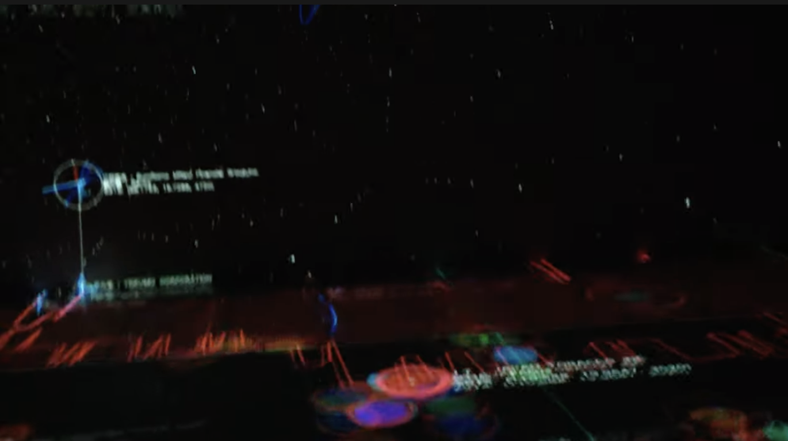

# openFrameworksとは

公式サイト
http://openframeworks.cc/

Zachary Lieberman, Theo Watson, Arturo Castroを中心に開発されたフレームワーク。  
Processingより後発でその影響を受けているが、 C++で開発するためより高速な処理ができる。  
スローガンは、**詩を書くようにコードを書け** （ポエティックコーディング）と 
**「DIY」（Do It Yourself）ではなく、「DIYO」（Do It With Others）みんなで作ろう。**  

グラフィックの描画の為のOpenGL、オーディオの入出力にはRtAudio、フォントの表示FreeTypeなど、様々なライブラリが
もともと用意されていて、表現に集中できるようになっている。また多くのアドオン(拡張機能)もある。  

**「糊（のり glue）」として例えられる。**

開発言語 : C++ 
開発環境 : Xcode visual studio

 
 
 

# 作品例

NightLights / YesYesNo  
http://www.yesyesno.com/night-lights 
  
  

traders by Rhizomatiks ( realtime visualization of Tokyo Stock Exchange ) 
https://www.youtube.com/watch?v=9E9vRNgxTLw
  
  

Canness Lions International Festival of Creativity 
真鍋大度、Perfume  
https://www.youtube.com/watch?v=gI0x5vA7fLo
 

Faces / Arturo Castro, Kyle McDonald

その他
 
CREATIVE APPLICATIONS NETWORK – openFrameworks Tag 
https://www.creativeapplications.net/tag/openframeworks/
