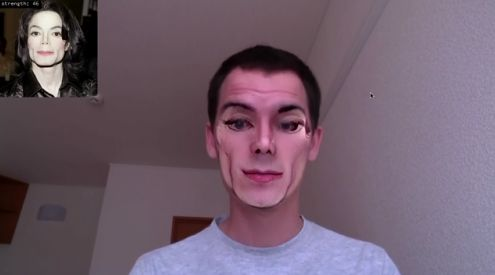

# openFrameworksとは

公式サイト
http://openframeworks.cc/

Zachary Lieberman, Theo Watson, Arturo Castroを中心に開発されたフレームワーク。  
Processingより後発でその影響を受けているが、 C++で開発するためより高速な処理ができる。  

グラフィックの描画の為のOpenGL、オーディオの入出力にはRtAudio、フォントの表示FreeTypeなど、様々なライブラリが
もともと用意されていて、表現に集中できるようになっている。また多くのアドオン(拡張機能)もある。  

**「糊（のり glue）」として例えられる。**

開発言語 : C++ 
開発環境 : Xcode visual studio

# 作品例

Canness Lions International Festival of Creativity 
真鍋大度、Perfume 

Faces 
Arturo Castro, Kyle McDonald

その他

CREATIVE APPLICATIONS NETWORK – openFrameworks Tag 
https://www.creativeapplications.net/tag/openframeworks/

## セットアップ方法
こちらからダウンロード 
https://openframeworks.cc/ja/download/

## プロジェクト設定

１、ファイルをダウンロード後、解凍し、projectGeneratorをアプリケーションフォルダに移動します。

２、projectGeneratorを起動すると、このような画面が出ると思います。
