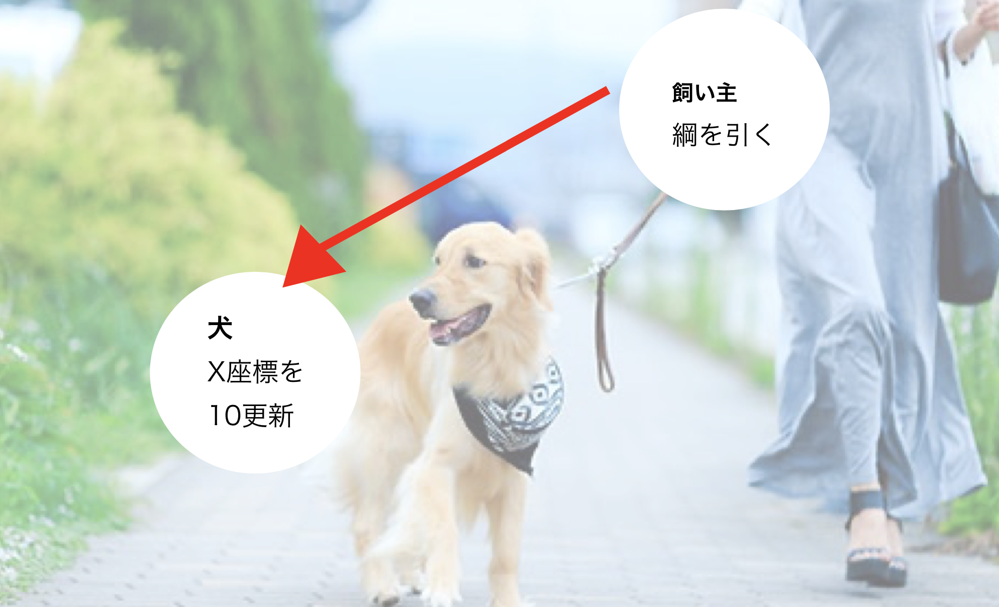
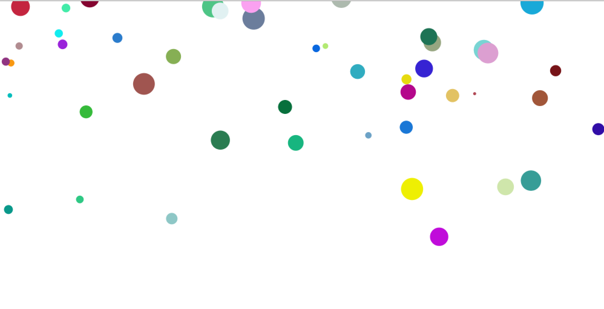
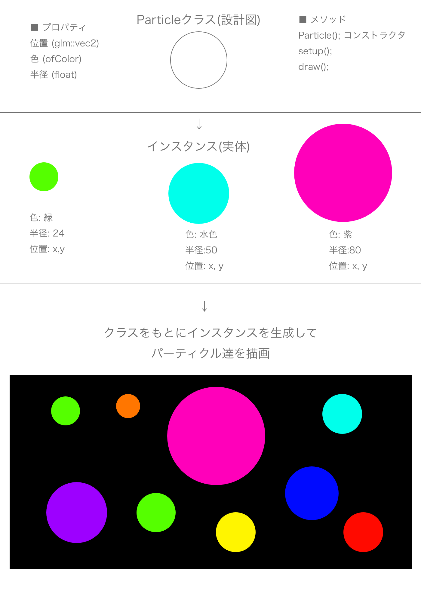

# オブジェクト指向プログラミング(object oriented programming)
現実世界の物に例えて、オブジェクト間でメッセージを送り合う設計で、<br>
プログラミングしていく考え方。oFではこちらを推奨。<br>
例えばこちらの例だと、「飼い主」「犬」「背景」などにソースを分けて管理する。



## 実際のオブジェクト指向のコード

多すぎる配列はコードが見にくいし書くのが面倒。<br>
x座標，y座標，速度...など一つのオブジェクトが持つデータの種類が増えてきたときが出番です<br>
コードの中で配列が全く出ない，<br>または１つか２つしか出ないコードにはOOPのメリットはそこまで光りません。。<br>

```
イメージの例: 

１、いままでの配列を使った書き方

座標が100個
色が100個
サイズが100個

for(100回){
	座標[i]
	色[i]
	サイズ[i]
	円を書く
}


２、クラス使った書き方
(座標、色、サイズ)のデータを持っている円が100個
for(100回){
	円を書く
}

```

# Processingで書いてみる



## 配列ver
```
int NUM = 100;

float[] x = new float[NUM];
float[] y = new float[NUM];
float[] vy = new float[NUM];         
float[] size = new float[NUM];       
color[] col = new color[NUM];       

void setup(){
  size(1000, 600);
  noStroke();                   
  for(int i=0; i<NUM; i++){
    x[i] = random(width);
    y[i] = random(height);
    vy[i] = random(1,3);        
    size[i] = random(5, 40);    
    col[i] = color(random(255),random(255),random(255));
  }
}

void draw(){
  background(255);
  for(int i=0; i<NUM; i++){
    fill(col[i]);                                                  
    ellipse(x[i], y[i], size[i], size[i]);
    y[i] -= vy[i];               
  }
}

```

## classを使ったオブジェクト指向ver

```

class Circle{
  float x;
  float y;
  float vy;
  float size;
  color col;

  Circle(){
    x = random(width);       
    y = random(height);
    vy = random(1, 3);
    size = random(5, 40);
    col = color(random(255),random(255),random(255));
  }
  
  void display(){
    fill(col);
    ellipse(x, y, size, size);
    y -= vy;
  }
}

```

```


int NUM = 100;
Circle[] c = new Circle[NUM];

void setup(){
  noStroke();
  size(1000,600);
  for(int i=0; i<NUM; i++){
    c[i] = new Circle();
  }
}

void draw(){
  background(255);
  for(int i=0; i<NUM; i++){
    c[i].display();
  }
}


```


# openFrameworksでクラスとインスタンスを使ってみる
classは設計図。インスタンスはそれに基づいて生成した実態。<br>
先程のオブジェクト指向をopenFrameworks版で書いてみる<br>

## クラスファイルの作成
ファイル → new → file → c++ → クラス名を記述(今回はParticle) → 格納先はsrcフォルダを指定<br>
Particle.hpp (クラス名の先頭は大文字が流儀)


# シンプルなクラスの例



Particle.hpp
```
#pragma once

#include "ofMain.h"


class Particle{
    
public:

    // コンストラクタ (インスタンス化した時に実行されるメソッド)
    Particle();
    
    // メソッド
    void setup();
    void draw();
    
    // プロパティ
    glm::vec2 pos; // 位置
    ofColor col; // 色
    float radius; // 半径
    
};

```


Particle.cpp
```
#pragma once
#include "Particle.hpp"


Particle::Particle(){
    
}


void Particle::setup(){

    // 位置
    pos.x = ofRandom(300, 600);
    pos.y = ofRandom(300, 600);
    
    // 半径
    radius = ofRandom(10,50);
    
    // 色
    col = ofColor(ofRandom(255), ofRandom(255), ofRandom(255));
}

void Particle::draw(){
    ofSetColor(col);
    ofDrawCircle(pos.x, pos.y, radius);
}


```


ofApp.h
```
#pragma once

#include "ofMain.h"
#include "Particle.hpp"

class ofApp : public ofBaseApp{

    public:
        void setup();
        void update();
        void draw();
    
        // Particleクラス2つインスタンス化
        Particle p1;
        Particle p2;
};

```

ofApp.cpp
```
#include "ofApp.h"

//--------------------------------------------------------------
void ofApp::setup(){
    
    p1.setup();
    p2.setup();
    
}

//--------------------------------------------------------------
void ofApp::update(){

}

//--------------------------------------------------------------
void ofApp::draw(){
    
    
    p1.draw();
    p2.draw();

}


```


### 泡の様に上に上るソース
Particle.hpp
```
#pragma once

#include "ofMain.h"


class Particle{
    
public:

    Particle();
    void update();
    void draw();
    

    glm::vec2 pos;
    float vy;
    float size;
    ofColor col;
    
};

```

Particle.cpp
```
#pragma once
#include "Particle.hpp"


Particle::Particle(){
    pos.x = ofRandom(0,ofGetWidth());
    pos.y = ofRandom(0,ofGetWidth());
    vy = ofRandom(1, 3);
    size = ofRandom(5, 40);
    col = ofColor(ofRandom(255),ofRandom(255),ofRandom(255));
}

void Particle::update(){
    
    pos.y -= vy;
    
    if(pos.y < 0){
        pos.y = ofGetHeight();
    }

}

void Particle::draw(){
    
    ofSetColor(col);
    ofDrawCircle(pos.x,pos.y, size, size);
}
```

ofApp.h
```
#pragma once

#include "ofMain.h"
#include "Particle.hpp"

class ofApp : public ofBaseApp{

    public:
        void setup();
        void update();
        void draw();
    
        static const int NUM = 100;
    
        // Particleクラスをインスタンス化
        Particle p[NUM];
    
};

```

ofApp.cpp
```
#include "ofApp.h"

//--------------------------------------------------------------
void ofApp::setup(){
    
    ofSetFrameRate(60);
    
    ofBackground(0);
    
    ofSetCircleResolution(64);
    
}

//--------------------------------------------------------------
void ofApp::update(){
    
    for(int i=0; i<NUM; i++){
        p[i].update();
    }

}

//--------------------------------------------------------------
void ofApp::draw(){
    
    for(int i=0; i<NUM; i++){
        p[i].draw();
    }

}

```


### 引数渡すver

Particle.hpp
```
void setup(float r);
```
Particle.cpp
```
void Particle::setup(float r){
    // 位置
    pos.x = ofRandom(300, 600);
    pos.y = ofRandom(300, 600);
    
    // 半径
    radius = r;
    
    // 色
    col = ofColor(ofRandom(255), ofRandom(255), ofRandom(255));
}

```

ofApp.cpp
```
p1.setup(300);
p1.setup(200);

```


### 動的配列のクラス版 (少し難しいかも)
Particle.hpp
```
#pragma once

#include "ofMain.h"

class Particle{
    
public:
    
    // プロパティ
    glm::vec2 pos; // ポジション
    glm::vec2 speed; // スピード
    ofColor col; // 色
    
    // コンストラクタ
    Particle();
    
    // メソッド
    void update();
    void draw();
    void setPos(int x, int y);
    void setSpeed(float x, float y);
    void setColor(ofColor randomColor);
    
};
```

Particle.cpp
```
#include "Particle.hpp"

// コンストラクタ
Particle::Particle(){
    
}

void Particle::update(){
    pos += speed;
}

void Particle::draw(){
    ofSetColor(col);
    ofDrawCircle(pos.x, pos.y, 10);
}

void Particle::setPos(int x, int y){
    pos = glm::vec2(x, y);
}

void Particle::setSpeed(float x, float y){
    speed = glm::vec2(x,y);
}

void Particle::setColor(ofColor randomColor){
    col = randomColor;
}

```

ofApp.h
```
#pragma once

#include "ofMain.h"
#include "Particle.hpp"

class ofApp : public ofBaseApp{

    public:
        void setup();
        void update();
        void draw();
        void mousePressed(int x, int y, int button);
        void mouseDragged(int x, int y, int button);
        void keyPressed(int key);
    
    
    vector <Particle> particles;
    
};

```

ofApp.cpp

```
#include "ofApp.h"

//--------------------------------------------------------------
void ofApp::setup(){
    
    //円の角の数(円を滑らかにする)
    ofSetCircleResolution(64);
    
    // フレームレート60に
    ofSetFrameRate(60);
    
    // 背景黒
    ofBackground(0);
    
    // アルファ使用可能に
    ofEnableAlphaBlending();
}

//--------------------------------------------------------------
void ofApp::update(){
    
    for(int i=0; i<particles.size(); i++){
        particles[i].update();
    }

}
//--------------------------------------------------------------
void ofApp::draw(){
    
    for(int i=0; i<particles.size(); i++){
        particles[i].draw();
    }
    
}
//--------------------------------------------------------------
void ofApp::mousePressed(int x, int y, int button){
    
    
    // インスタンス生成
    Particle p;
    
    
    // クリック座標位置
    p.setPos(x, y);
    
    // ランダムなスピード
    glm::vec2 randomSpeed;
    randomSpeed.x = ofRandom(-5,5);
    randomSpeed.y = ofRandom(-5,5);
    p.setSpeed(randomSpeed.y, randomSpeed.y);
    
    // ランダムな色設定
    ofColor randColor;
    randColor.set(ofRandom(255), ofRandom(255), ofRandom(255));
    p.setColor(randColor);

    // 今までの情報を含んだインスタンスpを動的配列に追加
    particles.push_back(p);

    
}

//--------------------------------------------------------------
void ofApp::mouseDragged(int x, int y, int button){
    

}

void ofApp::keyPressed(int key){
    if(key == 'c'){
        particles.clear();
    }
}

```
