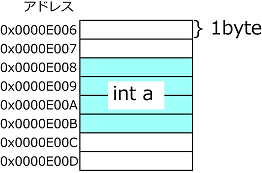

# ポインタとアドレス
ポインタとは、変数のアドレスを取り扱う変数のことです。<br>
アドレスとはメモリ上に与えられた番号のことです。<br>

## コードを書いて確かめる
変数を宣言すると、その変数にアドレスすなわちメモリ上の番号が与えられます。<br>
<br>

<br>
<br>

参考:
http://www.isc.meiji.ac.jp/~re00079/EX2.2009/2009_24.html

```

 // フレームレート表示
 ofDrawBitmapString(ofToString(ofGetFrameRate()) + "fps", 20, 20);


 int num = 10; // int型変数

 // 普通にint型numを出力
 cout << num << endl;   // 結果10

 // 変数numのアドレスを出力 (頭に&をつける)
 cout << &num << endl;   // 結果0x7ffeefbff3c8

 // ポインタ変数の作成方法
 int* pNum = &num;
 cout << pNum << endl;   // 結果0x7ffeefbff3c8
 

```


- ポインタ変数はアドレスを保存する変数
- ポインタ変数はアドレスを保存する変数
- ポインタ変数の宣言は型の後ろに* をつける int* pNum
- 変数のアドレスを知るには &をつける &num
- ポインタ変数から値を取るには変数名の前に*をつける *pNum　間接参照演算子


## クラスでポインタを使って高速化
大量表示の時にありがたみがわかると思います。

ofApp.hpp

```
#pragma once

#include "ofMain.h"
#include "SineCircle.hpp" //クラスのインクルード

class ofApp : public ofBaseApp{

　　public:
	void setup();
	void update();
	void draw();
  
    //配列数
    static const int NUM = 10000;
    
    //インスタンス用ポインタ変数
    SineCircle* sc[NUM];
    
    //座標
    glm::vec2 pos[NUM];
    
    //色相
    int hue[NUM];
  
};
```

ofApp.cpp
```
#include "ofApp.h"

//--------------------------------------------------------------
void ofApp::setup(){
    
    ofBackground(0);
    ofSetCircleResolution(64);
    
    
    for(int i=0; i<NUM; i++){
        pos[i].x = i * 20;
	pos[i].y = j * 20;
	hue[i] = (int)ofRandom(360); //キャスト

	//インスタンスの生成
	sc[i] = new SineCircle(&pos[i], &hue[i]);
    }
}

//--------------------------------------------------------------
void ofApp::update(){

    for(int i=0; i<NUM; i++){
        sc[i]->updata();
    }
    
}

//--------------------------------------------------------------
void ofApp::draw(){

   // フレームレート表示
   //ofDrawBitmapString(ofToString(ofGetFrameRate()) + "fps", 20, 20);
 
   for(int i=0; i<NUM; i++){
       sc[i]->draw();
   }
}

```

SineCircle.hpp

```
#pragma once
#include "ofMain.h"


//クラス宣言
class SineCircle{
    
public:
    
    //コンストラクタ　最初に呼ばれる
    SineCircle(glm::vec2* pPos, int* pHue);
    
    //メソッド
    void updata();
    void draw();
    void setHSBA(int,int,int,int);
    
    //プロパティ
    glm::vec2 pos;
    float diameter;
    int speed;
    int angle;
    int hue;
    
};
```

SineCircle.cpp

```

#include "SineCircle.hpp"


//コンストラクタ
SineCircle::SineCircle(ofVec2f* pPos, int* pHue){
    //初期座標
    pos.x = pPos->x;
    pos.y = pPos->y;
    diameter = 0;
    angle = (int)ofRandom(360);
    speed = 2;
    hue = *pHue;
}

//メソッド
void SineCircle::updata(){
    angle += speed;
    if(angle>360){
        angle = 0;
    }
    diameter = sin(angle*DEG_TO_RAD) * ;
}

void SineCircle::draw(){
    setHSBA(hue,100,100,100);
    ofDrawCircle(pos.x, pos.y, diameter);
}

void SineCircle::setHSBA(int hue, int saturation, int brightness, int alpha){
    int setHue = (int)ofMap(hue, 0 , 360, 0, 255);
    int setSaturation = (int)ofMap(saturation, 0 , 100, 0, 255);
    int setBrightness = (int)ofMap(brightness, 0 , 100, 0, 255);
    int setAlpha = (int)ofMap(alpha, 0, 100, 0, 255);
    ofColor c;
    c.setHsb(setHue, setSaturation, setBrightness, setAlpha);
    return ofSetColor(c);
}

```


メモ
```

クラス名* 変数で宣言
&で渡して、*で受け取る
*がきたら->でget！

ofApp.hとcpp
------------------------------------
// 変数pos作る
ofVec2f pos;
// コンストラクタに&で渡す
SineCircle* sc = new SineCircle(&pos);
------------------------------------
SineCircle.cpp
------------------------------------
// &できたので*で受け取る
SineCircle::SineCircle(ofVec2f* pPos){
    // *がきたので->でゲット！
    pos.x = pPos->x;
    pos.y = pPos->y;
}
------------------------------------
SineCircle* sc
*で作った変数は
sc->update();
sr->draw();
みたいに->で使う。
```
