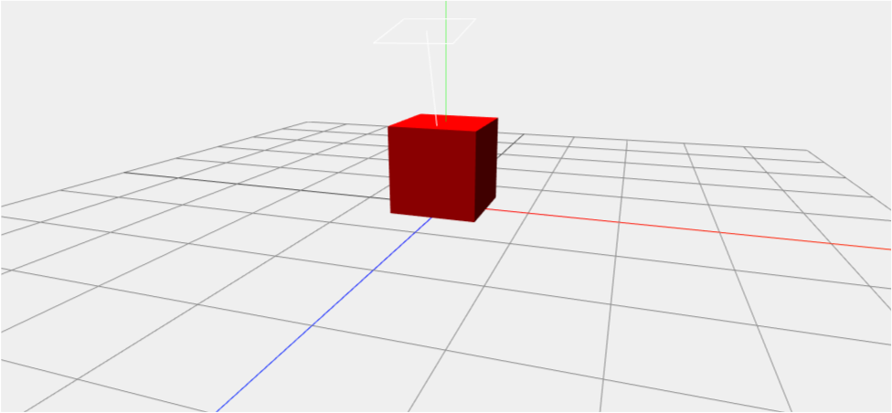
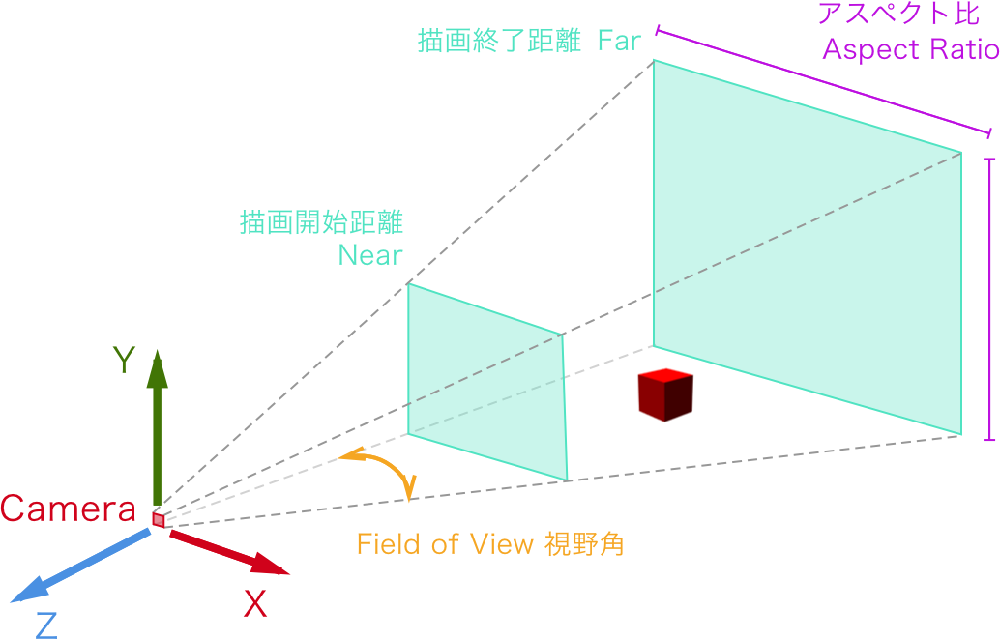
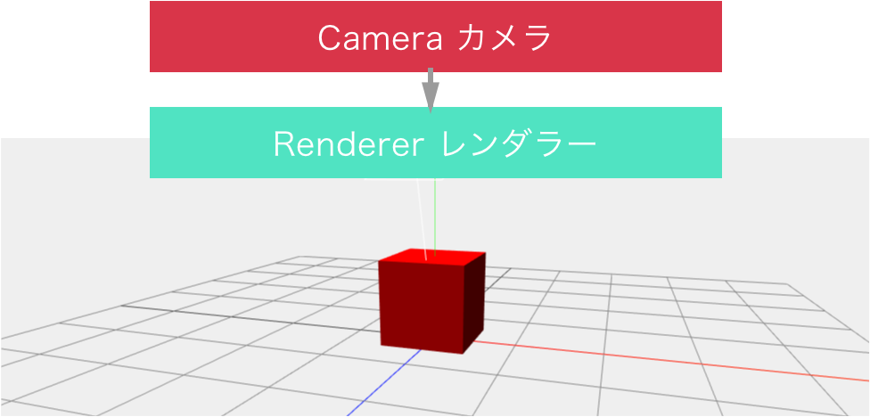
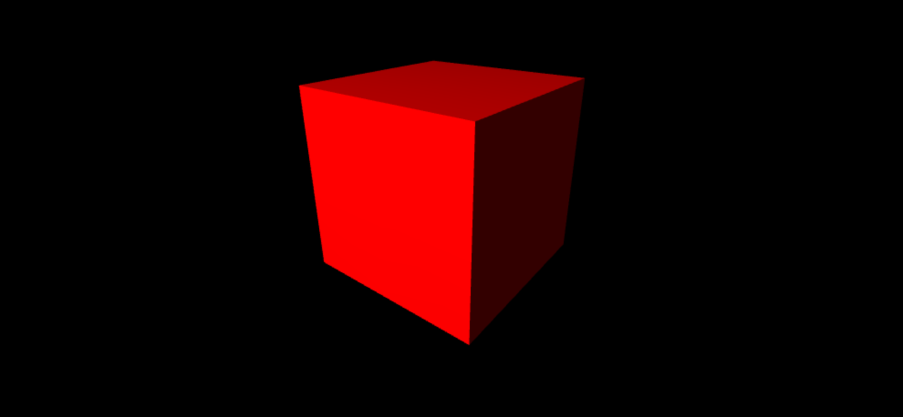
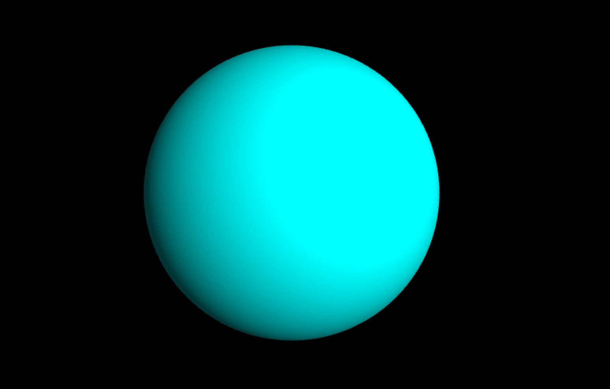
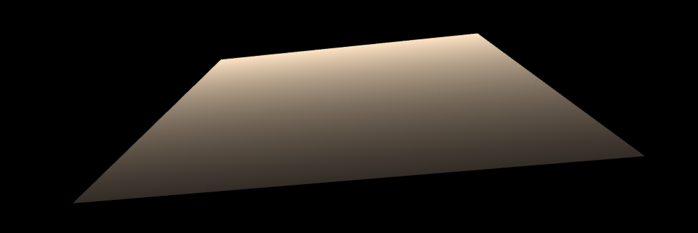
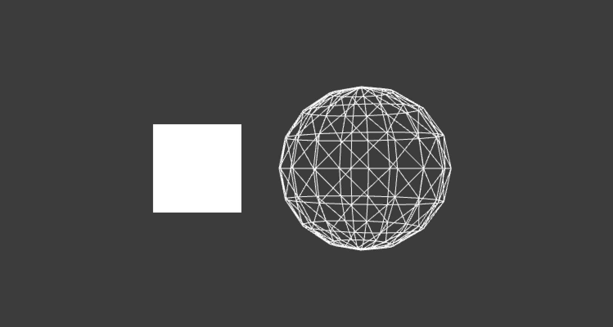
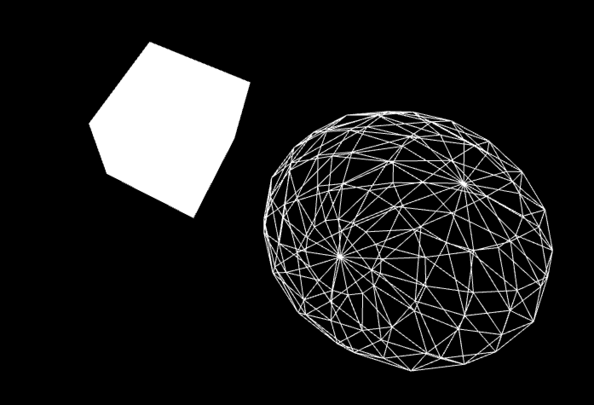
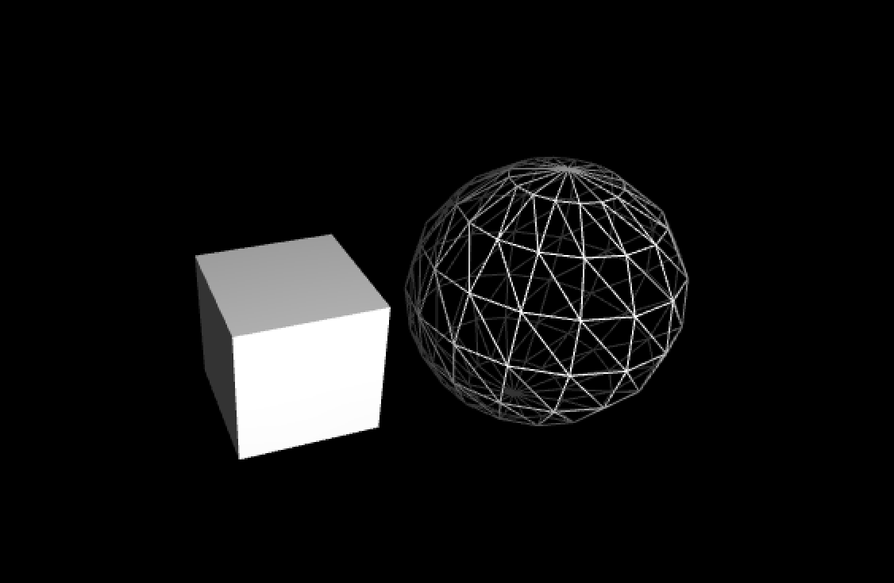

# 3Dグラフィックスプログラミング

コンピュータグラフィックの3D表現は3次元の仮想空間を作り、
その中をカメラを通して2Dとして見ている。 
左右(x座標)と上下(y座標)に加えて(z座標)奥行きが加わる。 


<br><br>
<br><br>
<br><br>


<!---->

## 3Dの基本図形 of3dPrimitive 

#### 立方体 

[ofBoxPrimitive](http://openframeworks.jp/documentation/3d/ofBoxPrimitive.html) 




&nbsp;


#### 球体 `ofSpherePrimitive` 
[ofSpherePrimitive](http://openframeworks.jp/documentation/3d/ofSpherePrimitive.html) 



&nbsp;


#### 平面 `ofPlanePrimitive` 

 [ofPlanePrimitive](http://openframeworks.jp/documentation/3d/ofPlanePrimitive.html) 


 

```
plane.set(640, 480); 幅 高さ
plane.setPosition(0, 0, 0); // ポシション
plane.setResolution(2, 2); // (as columns and rows) 

```


## 3Dオブジェクトを描画してみる
実際に3Dオブジェクトを描画してみましょう



ofApp.h

```

ofBoxPrimitive box;
ofSpherePrimitive sphere;

```

ofApp.cpp
```

// 座標を中心に
ofTranslate(ofGetWidth()/2, ofGetHeight()/2);

// 立方体
box.set(100); //幅、高さ、奥行き 100px
box.setPosition(0,0,0); // 位置指定
box.draw();

// 球体を描画
sphere.set(100,8); //半径100px、分割数8
sphere.setPosition(200, 0, 0);
//sphere.draw();
sphere.drawWireframe();

```


## カメラ


[ofEasyCam](http://openframeworks.jp/documentation/3d/ofEasyCam.html)

3D用の簡易カメラ。3Dでよく使われる中央起点に自動的に変わり、  
マウス操作で位置を変えることができる。（ofTranslateは無効に）

```

// カメラ開始
cam.begin();

// カメラ終了
cam.end();

// カメラの視野角 fov (Field of View) 視野角 60~90度が多い
cam.setFov(80.0f);

// カメラとの距離
cam.setDistance()

// カメラの位置
cam.setPosition()

// カメラが見る対象物を設定
cam.setTarget()

// 深度テスト DEPTH TEST
手前にあるものが奥にあるものを覆い隠すという現実世界の表現を 
シミュレートするために必要。 
無効のすると、新しく描画したオブジェクトがどんどん上書きされる。

ofEnableDepthTest()


```


```
//ofApp.h
ofEasyCam cam; // カメラ
ofBoxPrimitive box; // 立方体 
ofSpherePrimitive sphere; // 球体

```

```
//ofApp.cpp

void ofApp::setup(){
    ofSetFrameRate(60);
    ofBackground(0);
    ofEnableDepthTest(); //深度テストを有効に
    
    // カメラ設定
    cam.setFov(80.0f);
    cam.setPosition(0,0, +500);
}


void ofApp::draw(){

    cam.begin();
    
        // 立方体
        box.set(100); //幅、高さ、奥行き 100px
        box.setPosition(0,0,0); // 位置指定
        box.draw();
        
        // 球体を描画
        sphere.set(100,8); //半径100px、分割数8
        sphere.setPosition(200, 0, 0);
        //sphere.draw();
        sphere.drawWireframe();

    cam.end();
}
```


&nbsp;
&nbsp;

## ライト ofLight

ライトを追加して陰影をつけます。



[ofLight](http://openframeworks.jp/documentation/gl/ofLight.html)


```
//ofApp.h

    ofEasyCam cam; // カメラ
    ofBoxPrimitive box; // 立方体
    ofSpherePrimitive sphere; // 球体
    ofLight light; // ライト
    

```

```
//ofApp.cpp

void ofApp::setup(){

    ofSetFrameRate(60);
    ofBackground(0);
    ofEnableDepthTest(); //深度テストを有効に
    
    // カメラ設定
    cam.setFov(80.0f);
    cam.setPosition(0,0, +500);
    
    // スポットライト設置
    light.setSpotlight();
    light.setPosition(0, 300, 500); //ライトの位置
    light.enable();
   
}


void ofApp::draw(){

    cam.begin();
    
        // 立方体
        box.set(100); //幅、高さ、奥行き 100px
        box.setPosition(0,0,0); // 位置指定
        box.draw();
        
        // 球体を描画
        sphere.set(100,8); //半径100px、分割数8
        sphere.setPosition(200, 0, 0);
        //sphere.draw();
        sphere.drawWireframe();

    cam.end();
    
}


```

&nbsp;
&nbsp;


## マテリアル ofMaterial

[ofMaterial](http://openframeworks.jp/documentation/gl/ofMaterial.html)


ofSetColorで物体を塗りつぶす色を指定する他に、マテリアル(質感)を指定する方法があります。 
光を受けて反射する際の4つの光の色を想定して、その4つの光の色の反射を足し合わせることでリアルな材質を再現しています。

```

Ambient 環境光
setAmbientColor()
光源からの環境光が物体に当たって拡散されたときの色

Diffuse 拡散光
setDiffuseColor()
光源から放射された光が、物体に当たって拡散（乱反射）されるときの色

Specular 反射光
setSpecularColor()
光源から放射された光が、物体の表面で反射したときの色｡ 

Emissive 放射光
setEmissiveColor()
物体が自ら放射している光の色

```

```

//ofApp.h

    ofBoxPrimitive box; //立方体
    ofEasyCam cam; //カメラ
    ofMaterial material;
    ofLight light; //ライト
    
```


```
//ofApp.cpp

void ofApp::setup(){
	ofBackground(0);
    ofSetFrameRate(60);
    
    // カメラ設定
    cam.setFov(80.0f);
    cam.setPosition(0,300,500);
    
    ofEnableDepthTest();
    light.enable();
    light.setPosition(0,100,0);
    
    material.setAmbientColor(ofColor(0,0,255)); //ベースの色
    material.setDiffuseColor(ofColor(0,255,0)); //光が当たる色
    material.setShininess(120); //鏡面反射程度
    material.setSpecularColor(ofColor(255,0,0));//鏡面反射の色
}

void ofApp::draw(){

    cam.begin();
	
    // boxPrimitiveの描画
    ofSetColor(255, 0, 0); //カラー
    box.set(200); //サイズ
    box.setPosition(100,0,0); //座標
    material.begin(); //マテリアル描画開始
    box.draw(); //描画
    material.end(); //マテリアル描画終了
	
    cam.end();
}
```

&nbsp;

## ヘルパー


#### XYZ軸
`ofDrawAxis(1000);`

#### XYZ回転
`ofDrawRotationAxes(200,1,60);`
