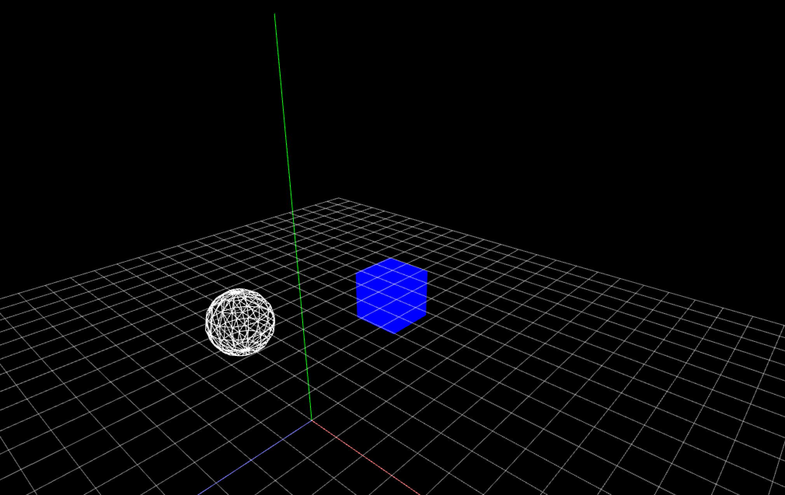

# 3Dグラフィックスプログラミング

コンピュータグラフィックの3D表現は3次元の仮想空間を作り、
その中をカメラを通して2Dとして見ている。 
左右(x座標)と上下(y座標)に加えて(z座標)奥行きが加わる。


## 3Dの基本図形 of3dPrimitive 

#### 立方体 

[ofBoxPrimitive](http://openframeworks.jp/documentation/3d/ofBoxPrimitive.html) 


&nbsp;


#### 球体 `ofSpherePrimitive` 
[ofSpherePrimitive](http://openframeworks.jp/documentation/3d/ofSpherePrimitive.html) 


&nbsp;


#### 平面 `ofPlanePrimitive` 

 [ofPlanePrimitive](http://openframeworks.jp/documentation/3d/ofPlanePrimitive.html) 


 

```
plane.set(640, 480); 幅 高さ
plane.setPosition(0, 0, 0); // ポシション
plane.setResolution(2, 2); // (as columns and rows) 

```


## 3Dオブジェクトを描画してみる
実際に3Dオブジェクトを描画してみましょう


ofApp.h

```

ofBoxPrimitive box;
ofSpherePrimitive sphere;

```

ofApp.cpp
```

// 座標を中心に
ofTranslate(ofGetWidth()/2, ofGetHeight()/2);

// 立方体
box.set(100); //幅、高さ、奥行き 100px
box.setPosition(0,0,0); // 位置指定
box.draw();

// 球体を描画
sphere.set(100,8); //半径100px、分割数8
sphere.setPosition(200, 0, 0);
//sphere.draw();
sphere.drawWireframe();

```


## カメラ


[ofEasyCam](http://openframeworks.jp/documentation/3d/ofEasyCam.html)

3D用の簡易カメラ。3Dでよく使われる中央起点に自動的に変わり、  
マウス操作で位置を変えることができる。（ofTranslateは無効に）

```

// カメラ開始
cam.begin();

// カメラ終了
cam.end();

// カメラの視野角 fov (Field of View) 視野角 60~90度が多い
cam.setFov(80.0f);

// カメラとの距離
cam.setDistance()

// カメラの位置
cam.setPosition()

// カメラが見る対象物を設定
cam.setTarget()

// 深度テスト DEPTH TEST
手前にあるものが奥にあるものを覆い隠すという現実世界の表現を 
シミュレートするために必要。 
無効のすると、新しく描画したオブジェクトがどんどん上書きされる。

ofEnableDepthTest()


```


```
//ofApp.h
ofEasyCam cam; // カメラ
ofBoxPrimitive box; // 立方体 
ofSpherePrimitive sphere; // 球体

```

```
//ofApp.cpp

void ofApp::setup(){
    ofSetFrameRate(60);
    ofBackground(0);
    ofEnableDepthTest(); //深度テストを有効に
    
    // カメラ設定
    cam.setFov(80.0f);
    cam.setPosition(0,0, +500);
}


void ofApp::draw(){

    cam.begin();
    
        // 立方体
        box.set(100); //幅、高さ、奥行き 100px
        box.setPosition(0,0,0); // 位置指定
        box.draw();
        
        // 球体を描画
        sphere.set(100,8); //半径100px、分割数8
        sphere.setPosition(200, 0, 0);
        //sphere.draw();
        sphere.drawWireframe();

    cam.end();
}
```


&nbsp;
&nbsp;

## ライト ofLight

ライトを追加して陰影をつけます。


[ofLight](http://openframeworks.jp/documentation/gl/ofLight.html)


```
//ofApp.h

    ofEasyCam cam; // カメラ
    ofBoxPrimitive box; // 立方体
    ofSpherePrimitive sphere; // 球体
    ofLight light; // ライト
    

```

```
//ofApp.cpp

void ofApp::setup(){

    ofSetFrameRate(60);
    ofBackground(0);
    ofEnableDepthTest(); //深度テストを有効に
    
    // カメラ設定
    cam.setFov(80.0f);
    cam.setPosition(0,0, +500);
    
    // スポットライト設置
    light.setSpotlight();
    light.setPosition(0, 300, 500); //ライトの位置
    light.enable();
   
}


void ofApp::draw(){
    
    ofEnableDepthTest();
    
    cam.begin();
    
        // 立方体
        box.set(100); //幅、高さ、奥行き 100px
        box.setPosition(0,0,0); // 位置指定
        box.draw();
        
        // 球体を描画
        sphere.set(100,8); //半径100px、分割数8
        sphere.setPosition(200, 0, 0);
        //sphere.draw();
        sphere.drawWireframe();

    cam.end();
    
}


```

&nbsp;
&nbsp;


## マテリアル ofMaterial

[ofMaterial](http://openframeworks.jp/documentation/gl/ofMaterial.html)


ofSetColorで物体を塗りつぶす色を指定する他に、マテリアル(質感)を指定する方法があります。 
光を受けて反射する際の4つの光の色を想定して、その4つの光の色の反射を足し合わせることでリアルな材質を再現しています。

```

Ambient 環境光
setAmbientColor()
光源からの環境光が物体に当たって拡散されたときの色

Diffuse 拡散光
setDiffuseColor()
光源から放射された光が、物体に当たって拡散（乱反射）されるときの色

Specular 反射光
setSpecularColor()
光源から放射された光が、物体の表面で反射したときの色｡ 

Emissive 放射光
setEmissiveColor()
物体が自ら放射している光の色

```

```

//ofApp.h

    ofBoxPrimitive box; //立方体
    ofEasyCam cam; //カメラ
    ofMaterial material;
    ofLight light; //ライト
    
```


```
//ofApp.cpp

void ofApp::setup(){
	ofBackground(0);
    ofSetFrameRate(60);
    
    // カメラ設定
    cam.setFov(80.0f);
    cam.setPosition(0,300,500);
    
    ofEnableDepthTest();
    light.enable();
    light.setPosition(0,100,0);
    
    material.setAmbientColor(ofColor(0,0,255)); //ベースの色
    material.setDiffuseColor(ofColor(0,255,0)); //光が当たる色
    material.setShininess(120); //鏡面反射程度
    material.setSpecularColor(ofColor(255,0,0));//鏡面反射の色
}

void ofApp::draw(){

    cam.begin();
	
    // boxPrimitiveの描画
    ofSetColor(255, 0, 0); //カラー
    box.set(200); //サイズ
    box.setPosition(100,0,0); //座標
    material.begin(); //マテリアル描画開始
    box.draw(); //描画
    material.end(); //マテリアル描画終了
	
    cam.end();
}
```

&nbsp;

## ヘルパー


#### XYZ軸
`ofDrawAxis(1000);`

#### XYZ回転
`ofDrawRotationAxes(200,1,60);`


#### グリッド（カスタム）

```
//ofApp.h
void gridHelper(int size, int step);
```

```
//ofApp.cpp
void ofApp::gridHelper(int size, int step){
    ofSetColor(0,20);
    for (int i=0; i<size; i+=step) {
        ofDrawLine(i-size/2, 0, size/2, i-size/2, 0, -size/2);
        ofDrawLine(-size/2, 0, i-size/2, size/2, 0, i-size/2);
    }
}
```

# カメラワーク 



## シーンの切り替え
Aキーと
```
カメラの注視点の設定

// 注視点を原点(0,0,0)に向けます
cam.setTarget(ofVec3f(0,0,0));

// オブジェクトの位置に注視点を向けることもできます
ofBoxPrimitive box
cam.setTarget(box);
```


ofApp.h
```
    void keyPressed(int key);
    
    ofEasyCam cam; // カメラ
    ofBoxPrimitive box; // 立方体
    ofSpherePrimitive sphere; // 球体
```

ofApp.cpp
```
void ofApp::setup(){

    ofBackground(0);
    ofSetFrameRate(60);
    
    // カメラ設定
    cam.setFov(80.0f);
    cam.setPosition(0,+500,+1000);
    
    // 中心を視点に
    cam.setTarget(ofVec3f(0,0,0));
        
}

void ofApp::draw(){
    
   
    cam.begin();

        
        // 立方体
        box.set(100); //幅、高さ、奥行き 100px
        ofSetColor(0,0,255); // 青色に
        box.setPosition(500,0,0); // 位置指定
        box.draw();
        
        // 球体を描画
        sphere.set(100,8); //半径100px、分割数8
        sphere.setPosition(-500, 0, 0);
        ofSetColor(255); // 青色に
        //sphere.draw();
        sphere.drawWireframe();
    
    
    cam.end();
}

void ofApp::keyPressed(int key){
 
    if (key == 'a'){
        cam.setTarget(box);
    }
    else if (key == 'b'){
        cam.setTarget(sphere);
    }
}

```

## イージングをかけつつランダムにカメラの位置を移動する

ofApp.h
```

    void keyPressed(int key);
    void gridHelper(int size, int step);
     
    ofBoxPrimitive box; // 立方体
    ofSpherePrimitive sphere; // 球体
    
    
    //カメラ
    ofEasyCam cam;
    ofVec3f camPos; // カメラの座標
    ofVec3f targetCamPos; //カメラの目的地
    ofVec3f camLook; //カメラの視点
    ofVec3f targetCamLook; //カメラ視点の目的地
    float camEasing = 0.03; //カメラアニメーションのイージング
    
    //シーン管理
    int scene = 0;
```

ofApp.cpp

```

void ofApp::setup(){

    ofBackground(0);
    ofSetFrameRate(60);

    //カメラの初期値
    camPos.set(0, +1000, +1000);
    cam.setPosition(camPos);
    
    // カメラの注意点
    camLook.set(0,0,0);
    //cam.setTarget(camLook);
    cam.lookAt(camLook);
    
    scene = 0;
    
        
}

void ofApp::update(){
    
    // 中視点の向き先
    if(scene == 0){
        cam.lookAt(ofVec3f(0,0,0));
        
    } else {
        
        // カメライージングの公式
        // 現在位置+= (目的地 - 現在地) * イージング係数;
        camPos += (targetCamPos - camPos) * camEasing;
        cam.setPosition(camPos);
        
        if(scene == 1){
            cam.lookAt(box);
        }
        else if(scene == 2){
            cam.lookAt(sphere);
        }
        
    }

}

void ofApp::draw(){
    
   
    cam.begin();

        
        // 立方体
        box.set(100); //幅、高さ、奥行き 100px
        ofSetColor(0,0,255); // 青色に
        box.setPosition(300,500,0); // 位置指定
        box.draw();
        
        // 球体を描画
        sphere.set(100,8); //半径100px、分割数8
        sphere.setPosition(-300, 200, 0);
        ofSetColor(255); // 青色に
        //sphere.draw();
        sphere.drawWireframe();
    
        //ヘルパー
        ofDrawAxis(1000);
        ofSetColor(0);
        gridHelper(3000, 100);
    
    
    cam.end();
}

void ofApp::keyPressed(int key){
 
    if (key == 'a'){
       scene = 1;
       targetCamPos.set(ofRandom(-1000,1000),ofRandom(-1000,1000),ofRandom(-1000,1000));
       //targetCamPos.set(ofVec3f(200,500,0));
    }
    else if (key == 'b'){
       scene = 2;
       //targetCamPos.set(ofVec3f(-100,100,0));
       targetCamPos.set(ofRandom(-1000,1000),ofRandom(-1000,1000),ofRandom(-1000,1000));
    }
}


void ofApp::gridHelper(int size, int step){
    ofSetColor(255,127);
    for (int i=0; i<size; i+=step) {
        ofDrawLine(i-size/2, 0, size/2, i-size/2, 0, -size/2);
        ofDrawLine(-size/2, 0, i-size/2, size/2, 0, i-size/2);
    }
}


```


## 球面座標のアニメーションプログラミング
PointSphere.hpp
```
#pragma once
#include "ofMain.h"

#ifndef PointSphere_hpp
#define PointSphere_hpp

#include <stdio.h>

class PointSphere{
public:
    //コンストラクタ
    PointSphere();
    //メソッド
    void setup();
    void update();
    void draw();
    
    //プロパティ
    //座標
    ofVec3f pos;
    //目的座標
    ofVec3f targetPos;
    //半径
    float radius;
    //イージング
    float easing = 0.05;

};

#endif /* PointSphere_hpp */
```

PointSphere.cpp
```

#include "PointSphere.hpp"

PointSphere::PointSphere(){
    //球の半径の初期値
    radius = 300.0;
    //初期座標
    pos.set(0,0,0);
    //目的地の初期座標
    targetPos.set(0,0,0);
    //最初のアニメーション
    setup();
}

void PointSphere::setup(){
    //球面座標のランダム角度θとφ
    float randTheta = ofRandom(360);
    float randPhi = ofRandom(180);
    //球面座標のXYZ
    targetPos.x = radius * sin(ofDegToRad(randTheta)) * cos(ofDegToRad(randPhi));
    targetPos.y = radius * sin(ofDegToRad(randTheta)) * sin(ofDegToRad(randPhi));
    targetPos.z = radius * cos(ofDegToRad(randTheta));
}

void PointSphere::update(){
    //イージング
    ofVec3f distance; //2点間の距離
    distance = targetPos - pos;
    pos = pos + distance * easing;
}

void PointSphere::draw(){
    ofSetColor(127);
    ofDrawSphere(pos.x, pos.y, pos.z,1.0);
}

```

ofApp.h
```
#pragma once

#include "ofMain.h"
#include "PointSphere.hpp"

class ofApp : public ofBaseApp{

	public:
		void setup();
		void update();
		void draw();
        void gridHelper(int size, int step);

    //カメラ
    ofEasyCam cam;
    
    //配列の数
    static const int NUM = 500;
    //ポイントの座標
    ofVec3f pos[NUM];
    //クラスのポインタ変数
    PointSphere* point[NUM];
};

```


ofApp.cpp
```

#include "ofApp.h"

//--------------------------------------------------------------
void ofApp::setup(){
    
    ofBackground(255);
    ofSetFrameRate(60);
    ofEnableDepthTest();//深度
    //カメラの設定
    cam.setFov(80.0f);
//    cam.setPosition(0, 20, 100);
    cam.setDistance(500);
    
    
    for(int i=0; i<NUM; i++){
        //インスタンスの宣言
        point[i] = new PointSphere();
    }
}

//--------------------------------------------------------------
void ofApp::update(){
    
    //値の更新
    for(int i=0; i<NUM; i++){
        
        if(ofGetFrameNum() % 120 == 0){
            //2秒に1回
            point[i]->setup();
        }
        point[i]->update();
    }
}

//--------------------------------------------------------------
void ofApp::draw(){
    //起点をずらす
    ofTranslate(ofGetWidth()/2,ofGetHeight()/2,0);
    cam.begin();
    gridHelper(1000, 10);
    ofDrawAxis(1000);
    
    //Y軸回転
    ofRotateYRad(ofGetFrameNum() * 0.005);
    
    //描画
    for(int i=0; i<NUM; i++){
        point[i]->draw();
    }
    
    //ポイント同士の距離を測って線で結ぶ
    //2重ループで測る
    for (int j=0; j<NUM; j++) {
        for(int i=0; i<NUM; i++){
            float d = ofDist(point[j]->pos.x, point[j]->pos.y, point[j]->pos.z, point[i]->pos.x, point[i]->pos.y, point[i]->pos.z);
            if(d < 40){
                int c = (int) ofMap(d,0,40,10,200);
                ofSetColor(c);
                ofDrawLine(point[j]->pos.x, point[j]->pos.y, point[j]->pos.z, point[i]->pos.x, point[i]->pos.y, point[i]->pos.z);
            }
        }
    }
    cam.end();
}

//--------------------------------------------------------------
void ofApp::gridHelper(int size, int step){
    ofSetColor(0,20);
    for (int i=0; i<size; i+=step) {
        ofDrawLine(i-size/2, 0, size/2, i-size/2, 0, -size/2);
        ofDrawLine(-size/2, 0, i-size/2, size/2, 0, i-size/2);
    }
}

```

