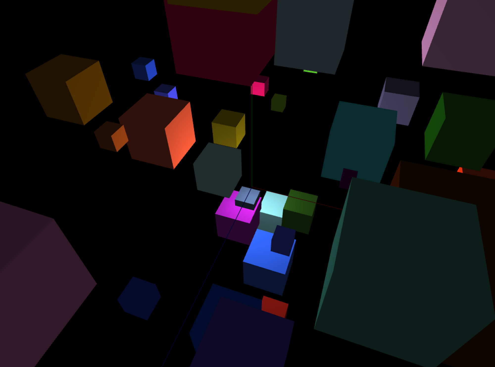

# カメラワーク


## シーンの切り替え


AキーとBキーを押した時にそれぞれ注視点を切り替えるプログラムを作ってみます。

```
カメラの注視点の設定

// 注視点を原点(0,0,0)に向けます
cam.setTarget(ofVec3f(0,0,0));

// オブジェクトの位置に注視点を向けることもできます
ofBoxPrimitive box
cam.setTarget(box);
```


ofApp.h
```
#pragma once

#include "ofMain.h"

class ofApp : public ofBaseApp{

	public:
		void setup();
		void update();
		void draw();
                void keyPressed(int key);

    
    ofEasyCam cam; // カメラ
    ofBoxPrimitive box; // 立方体
    ofSpherePrimitive sphere; // 球体
    
		
};

```

ofApp.cpp
```

#include "ofApp.h"

void ofApp::setup(){

 
    ofSetFrameRate(60);
    ofEnableDepthTest(); //深度テストを有効に
    
    
    // カメラ設定
    cam.setPosition(0,+500,+1000);
    
    // 中心を視点に
    cam.setTarget(ofVec3f(0,0,0));
    
    ofBackground(0);
        
}
void ofApp::update(){

}

void ofApp::draw(){
    
   
    cam.begin();

        
        // 立方体
        box.set(100); //幅、高さ、奥行き 100px
        ofSetColor(0,0,255); // 青色に
        box.setPosition(500,0,0); // 位置指定
        box.draw();
        
        // 球体を描画
        sphere.set(100,8); //半径100px、分割数8
        sphere.setPosition(-500, 0, 0);
        ofSetColor(255); // 青色に
        //sphere.draw();
        sphere.drawWireframe();
	
	ofDrawAxis(1000);
    
    
    cam.end();
}

void ofApp::keyPressed(int key){
 
    if (key == 'a'){
        cam.setTarget(box);
    }
    else if (key == 'b'){
        cam.setTarget(sphere);
    }
}

```

## 中心を見つめたままカメラの自走
ofApp.h
```
#include "ofMain.h"

class ofApp : public ofBaseApp{

	public:
		void setup();
		void update();
		void draw();

    ofBoxPrimitive box; // 立方体
    ofEasyCam cam;
    ofVec3f camPos; // カメラの位置
    float theta;
		
};

```
ofApp.cpp
```
#include "ofApp.h"

//--------------------------------------------------------------
void ofApp::setup(){
    
    
    ofBackground(0);
    ofSetFrameRate(60);
    ofEnableDepthTest();

    //カメラの初期値
    camPos.set(ofVec3f(0, 0, 0));
    cam.setPosition(camPos);

}

//--------------------------------------------------------------
void ofApp::update(){
    
    
    
    // グルグル回す
    camPos.x = 1000 * sin(theta * DEG_TO_RAD);
    camPos.y = 1000;
    camPos.z = 1000 * cos(theta * DEG_TO_RAD);
    cam.setPosition(camPos);
    cam.setTarget(ofVec3f(0,0,0));
    
    
    theta+=0.5;
    if(theta > 360){
        theta = 0;
    }
    

}

//--------------------------------------------------------------
void ofApp::draw(){
    
    
    cam.begin();
        
        // 立方体
        box.set(100); //幅、高さ、奥行き 100px
        box.setPosition(0,0,0); // 位置指定
        box.drawWireframe();
    
    
        ofDrawAxis(1000);
    
    cam.end();
    
    
}
```

## ボックスを増やしてみる


ofApp.h
```
#pragma once

#include "ofMain.h"

class ofApp : public ofBaseApp{

	public:
		void setup();
		void update();
		void draw();

    static const int NUM = 50;
    ofBoxPrimitive box[NUM]; // 立方体
    ofVec3f boxPos[NUM];
    float boxSize[NUM];
    ofColor boxCol[NUM];
    
    ofLight light;
    

    ofEasyCam cam;
    ofVec3f camPos; // カメラの位置
    float theta;
};

```

of.cpp
```
#include "ofApp.h"

//--------------------------------------------------------------
void ofApp::setup(){
    
    
    ofBackground(0);
    ofSetFrameRate(60);
    ofEnableDepthTest();

    //カメラの初期値
    camPos.set(ofVec3f(0, 0, 0));
    cam.setPosition(camPos);
    //cam.setPosition(camPos);
    
    light.setPointLight();
    light.setPosition(0, 0, 0);
    light.enable();
    
    // カメラの注意点
    cam.setTarget(ofVec3f(0,0,0));
    
    // ボックスのポジション
    for (int i=0; i<NUM; i++) {
        box[i].set(ofRandom(30,200)); //幅、高さ、奥行き 100px
        
        ofVec3f pos;
        pos.x = ofRandom(-500,1000);
        pos.y = ofRandom(-500,1000);
        pos.z = ofRandom(-500,1000);
        
        box[i].setPosition(pos); // 位置指定
        boxCol[i] = ofColor(ofRandom(256),ofRandom(256),ofRandom(256));
    }

}

//--------------------------------------------------------------
void ofApp::update(){
    
    
    
    // グルグル回す
    camPos.x = 1000 * sin(theta * DEG_TO_RAD);
    camPos.y = 1000;
    camPos.z = 1000 * cos(theta * DEG_TO_RAD);
    cam.setPosition(camPos);
    cam.setTarget(ofVec3f(0,0,0));
    
    
    theta+=0.5;
    if(theta > 360){
        theta = 1;
    }

}

//--------------------------------------------------------------
void ofApp::draw(){
    
    
    cam.begin();
        
        // 立方体の描画
        for (int i=0; i<NUM; i++) {
            ofSetColor(boxCol[i]);
            box[i].draw();
        }
    
    
        ofDrawAxis(1000);
    
    cam.end();
    
    
}

```


## イージングをかけつつランダムにカメラの位置を移動する

ofApp.h
```
#pragma once

#include "ofMain.h"

class ofApp : public ofBaseApp{

public:
    void setup();
    void update();
    void draw();
    void keyPressed(int key);

    
    static const int NUM = 50;
    ofBoxPrimitive box[NUM]; // 立方体
    ofVec3f boxPos[NUM];
    int randBoxNum;
    float boxSize[NUM];
    ofColor boxCol[NUM];
    
    
    
    ofEasyCam cam;
    ofLight light;
    ofVec3f camPos; // カメラの座標
    ofVec3f targetCamPos; //カメラの目的地
    ofVec3f camLook; //カメラの視点
    ofVec3f targetCamLook; //カメラ視点の目的地
    float camEasing = 0.03; //カメラアニメーションのイージング
    
    
    //シーン管理
    int scene = 0;
};
```

ofApp.cpp
```

#include "ofApp.h"

//--------------------------------------------------------------
void ofApp::setup(){
    
    
    ofBackground(255);
    ofSetFrameRate(60);
    ofEnableDepthTest();
    
    
    //カメラの初期値
    camPos.set(0, +1000, +1000);
    cam.setPosition(camPos);
    
    // カメラの注意点
    camLook.set(0,0,0);
    //cam.setTarget(camLook);
    cam.setTarget(camLook);
    
    light.setPointLight();
    light.setPosition(0, 0, 0);
    light.enable();

    scene = 0;
    
    
    
    // ボックスのポジション
    for (int i=0; i<NUM; i++) {
        box[i].set(ofRandom(30,200)); //幅、高さ、奥行き 100px
        
        ofVec3f pos;
        pos.x = ofRandom(-500,1000);
        pos.y = ofRandom(-500,1000);
        pos.z = ofRandom(-500,1000);
        
        box[i].setPosition(pos); // 位置指定
        boxCol[i] = ofColor(ofRandom(256),ofRandom(256),ofRandom(256));
    }

}

//--------------------------------------------------------------
void ofApp::update(){
    
    

    
    // 中視点の向き先
    if(scene == 0){
        cam.setTarget(ofVec3f(0,0,0));
        
    } else {
        
        // カメライージングの公式
        // 現在位置+= (目的地 - 現在地) * イージング係数;
        camPos += (targetCamPos - camPos) * camEasing;
        cam.setPosition(camPos);
        
        cam.setTarget(box[randBoxNum]);
        
    }
    

}

//--------------------------------------------------------------
void ofApp::draw(){
    
    
    cam.begin();
        
        // 立方体の描画
        for (int i=0; i<NUM; i++) {
            ofSetColor(boxCol[i]);
            box[i].draw();
        }
    
    
        ofDrawAxis(1000);
    
    cam.end();
    
}

void ofApp::keyPressed(int key){
 
    if (key == 'a'){
       scene = 1;
       randBoxNum = ofRandom(NUM);
       targetCamPos.set(ofRandom(-1000,1000),ofRandom(-1000,1000),ofRandom(-1000,1000));
    }
}


```
