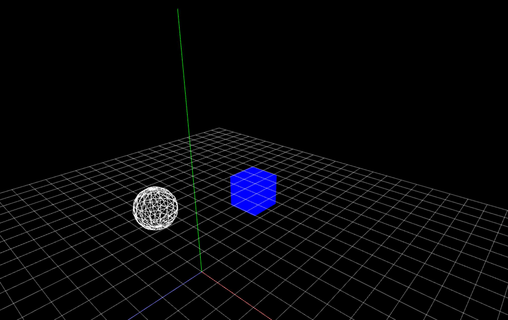
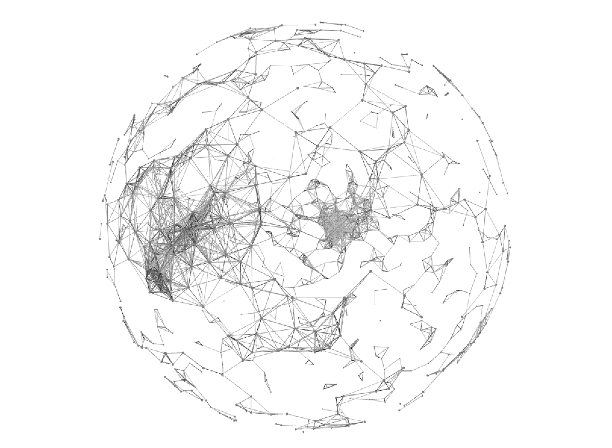

# カメラワーク


## シーンの切り替え



AキーとBキーを押した時にそれぞれ注視点を切り替えるプログラムを作ってみます。

```
カメラの注視点の設定

// 注視点を原点(0,0,0)に向けます
cam.setTarget(ofVec3f(0,0,0));

// オブジェクトの位置に注視点を向けることもできます
ofBoxPrimitive box
cam.setTarget(box);
```


ofApp.h
```
    void keyPressed(int key);
    
    ofEasyCam cam; // カメラ
    ofBoxPrimitive box; // 立方体
    ofSpherePrimitive sphere; // 球体
```

ofApp.cpp
```
void ofApp::setup(){

 
    ofSetFrameRate(60);
    ofEnableDepthTest(); //深度テストを有効に
    
    
    // カメラ設定
    cam.setFov(80.0f);
    cam.setPosition(0,+500,+1000);
    
    // 中心を視点に
    cam.setTarget(ofVec3f(0,0,0));
    
    ofBackground(0);
        
}

void ofApp::draw(){
    
   
    cam.begin();

        
        // 立方体
        box.set(100); //幅、高さ、奥行き 100px
        ofSetColor(0,0,255); // 青色に
        box.setPosition(500,0,0); // 位置指定
        box.draw();
        
        // 球体を描画
        sphere.set(100,8); //半径100px、分割数8
        sphere.setPosition(-500, 0, 0);
        ofSetColor(255); // 青色に
        //sphere.draw();
        sphere.drawWireframe();
    
    
    cam.end();
}

void ofApp::keyPressed(int key){
 
    if (key == 'a'){
        cam.setTarget(box);
    }
    else if (key == 'b'){
        cam.setTarget(sphere);
    }
}

```

## イージングをかけつつランダムにカメラの位置を移動する

ofApp.h
```

    void keyPressed(int key);
    void gridHelper(int size, int step);
     
    ofBoxPrimitive box; // 立方体
    ofSpherePrimitive sphere; // 球体
    
    
    //カメラ
    ofEasyCam cam;
    ofVec3f camPos; // カメラの座標
    ofVec3f targetCamPos; //カメラの目的地
    ofVec3f camLook; //カメラの視点
    ofVec3f targetCamLook; //カメラ視点の目的地
    float camEasing = 0.03; //カメラアニメーションのイージング
    
    //シーン管理
    int scene = 0;
```

ofApp.cpp

```

void ofApp::setup(){

    ofBackground(0);
    ofSetFrameRate(60);

    //カメラの初期値
    camPos.set(0, +1000, +1000);
    cam.setPosition(camPos);
    
    // カメラの注意点
    camLook.set(0,0,0);
    //cam.setTarget(camLook);
    cam.lookAt(camLook);
    
    scene = 0;
    
        
}

void ofApp::update(){
    
    // 中視点の向き先
    if(scene == 0){
        cam.lookAt(ofVec3f(0,0,0));
        
    } else {
        
        // カメライージングの公式
        // 現在位置+= (目的地 - 現在地) * イージング係数;
        camPos += (targetCamPos - camPos) * camEasing;
        cam.setPosition(camPos);
        
        if(scene == 1){
            cam.lookAt(box);
        }
        else if(scene == 2){
            cam.lookAt(sphere);
        }
        
    }

}

void ofApp::draw(){
    
   
    cam.begin();

        
        // 立方体
        box.set(100); //幅、高さ、奥行き 100px
        ofSetColor(0,0,255); // 青色に
        box.setPosition(300,500,0); // 位置指定
        box.draw();
        
        // 球体を描画
        sphere.set(100,8); //半径100px、分割数8
        sphere.setPosition(-300, 200, 0);
        ofSetColor(255); // 青色に
        //sphere.draw();
        sphere.drawWireframe();
    
        //ヘルパー
        ofDrawAxis(1000);
        ofSetColor(0);
    
    cam.end();
}

void ofApp::keyPressed(int key){
 
    if (key == 'a'){
       scene = 1;
       targetCamPos.set(ofRandom(-1000,1000),ofRandom(-1000,1000),ofRandom(-1000,1000));
       //targetCamPos.set(ofVec3f(200,500,0));
    }
    else if (key == 'b'){
       scene = 2;
       //targetCamPos.set(ofVec3f(-100,100,0));
       targetCamPos.set(ofRandom(-1000,1000),ofRandom(-1000,1000),ofRandom(-1000,1000));
    }
}


```


## 球面座標のアニメーションプログラミング



PointSphere.hpp
```
#pragma once
#include "ofMain.h"

#ifndef PointSphere_hpp
#define PointSphere_hpp

#include <stdio.h>

class PointSphere{
public:
    //コンストラクタ
    PointSphere();
    //メソッド
    void setup();
    void update();
    void draw();
    
    //プロパティ
    //座標
    ofVec3f pos;
    //目的座標
    ofVec3f targetPos;
    //半径
    float radius;
    //イージング
    float easing = 0.05;

};

#endif /* PointSphere_hpp */
```

PointSphere.cpp
```

#include "PointSphere.hpp"

PointSphere::PointSphere(){
    //球の半径の初期値
    radius = 300.0;
    //初期座標
    pos.set(0,0,0);
    //目的地の初期座標
    targetPos.set(0,0,0);
    //最初のアニメーション
    setup();
}

void PointSphere::setup(){
    //球面座標のランダム角度θとφ
    float randTheta = ofRandom(360);
    float randPhi = ofRandom(180);
    //球面座標のXYZ
    targetPos.x = radius * sin(ofDegToRad(randTheta)) * cos(ofDegToRad(randPhi));
    targetPos.y = radius * sin(ofDegToRad(randTheta)) * sin(ofDegToRad(randPhi));
    targetPos.z = radius * cos(ofDegToRad(randTheta));
}

void PointSphere::update(){
    //イージング
    ofVec3f distance; //2点間の距離
    distance = targetPos - pos;
    pos = pos + distance * easing;
}

void PointSphere::draw(){
    ofSetColor(127);
    ofDrawSphere(pos.x, pos.y, pos.z,1.0);
}

```

ofApp.h
```
#pragma once

#include "ofMain.h"
#include "PointSphere.hpp"

class ofApp : public ofBaseApp{

	public:
		void setup();
		void update();
		void draw();
    //カメラ
    ofEasyCam cam;
    
    //配列の数
    static const int NUM = 500;
    //ポイントの座標
    ofVec3f pos[NUM];
    //クラスのポインタ変数
    PointSphere* point[NUM];
};

```


ofApp.cpp
```

#include "ofApp.h"

//--------------------------------------------------------------
void ofApp::setup(){
    
    ofBackground(255);
    ofSetFrameRate(60);
    ofEnableDepthTest();//深度
    //カメラの設定
    cam.setFov(80.0f);
    cam.setDistance(500);
    
    
    for(int i=0; i<NUM; i++){
        //インスタンスの宣言
        point[i] = new PointSphere();
    }
}

//--------------------------------------------------------------
void ofApp::update(){
    
    //値の更新
    for(int i=0; i<NUM; i++){
        
        if(ofGetFrameNum() % 120 == 0){
            //2秒に1回
            point[i]->setup();
        }
        point[i]->update();
    }
}

//--------------------------------------------------------------
void ofApp::draw(){

    ofTranslate(ofGetWidth()/2,ofGetHeight()/2,0);
    cam.begin();
    ofDrawAxis(1000);
    
    //Y軸回転
    ofRotateYRad(ofGetFrameNum() * 0.005);
    
    //描画
    for(int i=0; i<NUM; i++){
        point[i]->draw();
    }
    
    //ポイント同士の距離を測って線で結ぶ
    //2重ループで測る
    for (int j=0; j<NUM; j++) {
        for(int i=0; i<NUM; i++){
            float d = ofDist(point[j]->pos.x, point[j]->pos.y, point[j]->pos.z, point[i]->pos.x, point[i]->pos.y, point[i]->pos.z);
            if(d < 40){
                ofSetColor(0,0,0,100);
                ofDrawLine(point[j]->pos.x, point[j]->pos.y, point[j]->pos.z, point[i]->pos.x, point[i]->pos.y, point[i]->pos.z);
            }
        }
    }
    cam.end();
}

```

