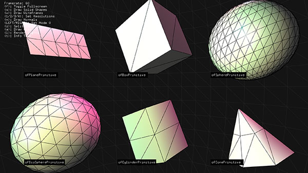
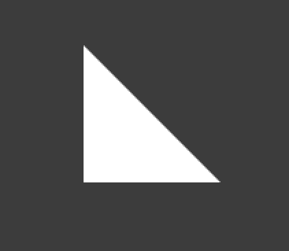
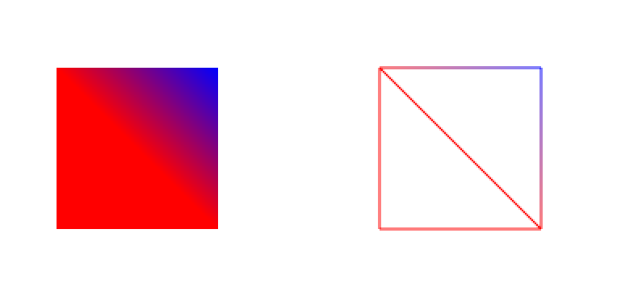
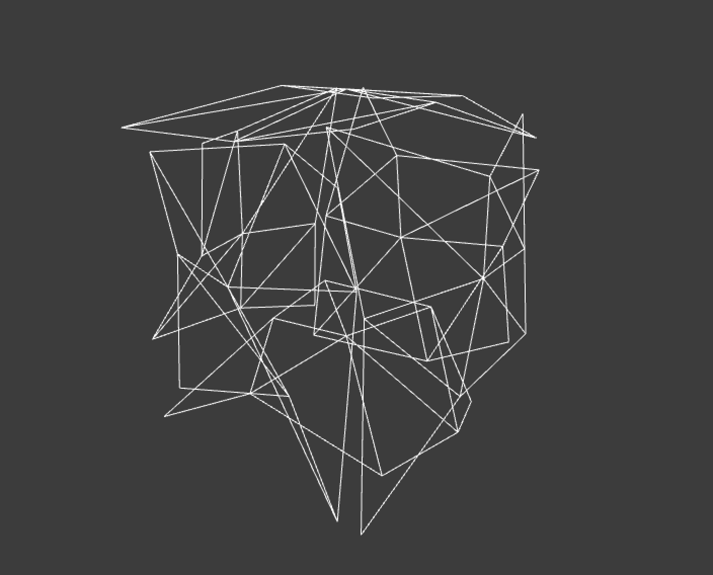
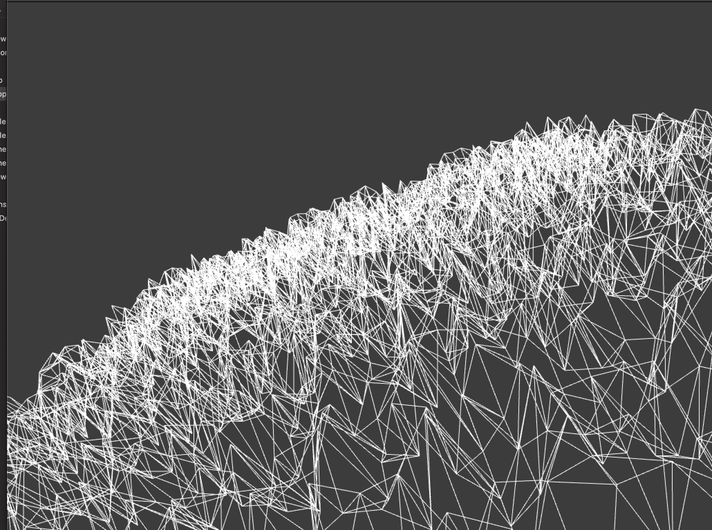

# メッシュ(ofMesh)について



3Dモデルは沢山の頂点を結んだポリゴンの集まりでできています。
ofMeshはポリゴンの集まりを格納できるクラスです。 
（ofMeshにはメッシュの頂点の位置や順番、色などが保存されている）

ofSpherePrimitiveや
ofBoxPrimitiveなども内部ではofMeshを使って描画しています。


```
ポリゴン：多角形のこと（三角形、四角形、五角形･･etc）

メッシュ：ポリゴンの集まりのこと

サーフェス：面のこと

```

参考 
https://blender-cg.net/polygon-mesh-surface/

## ポリゴンを書いてみる

### 三角形



ofApp.h
```
#pragma once

#include "ofMain.h"

class ofApp : public ofBaseApp{

    public:
        void setup();
        void update();
        void draw();
    ofMesh mesh;
};

```

ofApp.cpp
```
#include "ofApp.h"

//--------------------------------------------------------------
void ofApp::setup(){
    
    //ofBackground();
    ofSetFrameRate(60);
    
    //頂点の座標を指定2
    mesh.addVertex(ofVec3f(100,100,0));
    mesh.addVertex(ofVec3f(100,200,0));
    mesh.addVertex(ofVec3f(200,200,0));
    mesh.addVertex(ofVec3f(200,100,0));
}

//--------------------------------------------------------------
void ofApp::update(){
}

//--------------------------------------------------------------
void ofApp::draw(){
    
    // 描画
    mesh.draw();
    
    // 右にずらす
    ofTranslate(500, 0);
    
    // ワイヤーフレーム描画
    mesh.drawWireframe();
  
}

```


### 四角形




三角形を二つ頂点を結んで四角形のメッシュを描いてみる

ofApp.cpp
```

void ofApp::setup(){

    ofSetFrameRate(60);
    ofBackground(255);
    
    //頂点の座標を指定
    mesh.addVertex(ofVec3f(100,100,0));
    mesh.addVertex(ofVec3f(100,200,0));
    mesh.addVertex(ofVec3f(200,200,0));
    mesh.addVertex(ofVec3f(200,100,0));
    
    //座標のつなぎ順を指定して面にする
    // １個目の三角形
    mesh.addIndex(0);
    mesh.addIndex(1);
    mesh.addIndex(2);
    
    // ２個目の三角形
    mesh.addIndex(0);
    mesh.addIndex(3);
    mesh.addIndex(2);
    
    //頂点の色指定
    mesh.addColor(ofFloatColor(1.0,0.0,0.0));
    mesh.addColor(ofFloatColor(1.0,0.0,0.0));
    mesh.addColor(ofFloatColor(1.0,0.0,0.0));
    mesh.addColor(ofFloatColor(0.0,0.0,1.0));
}

void ofApp::draw(){
    mesh.draw(); //面表示
    ofTranslate(200, 0); //隣に移動
    mesh.drawWireframe(); //ワイヤー表示
}


```

## Primitiveオブジェクトのメッシュを取得していじってみる
getMesh(); メソッドでPrimitiveオブジェクトからmesh情報を取得できます。




ofApp.h
```
#pragma once

#include "ofMain.h"

class ofApp : public ofBaseApp{

    public:
        void setup();
        void update();
        void draw();

    ofEasyCam cam;
    ofMesh mesh;
    
};

```

ofApp.cpp
```
//--------------------------------------------------------------
void ofApp::setup(){
    
    ofBoxPrimitive box;
    box.set(200);
    //box.setResolution(10);  //数値が大きいほど立方体を構成するメッシュの量が増える
    
    // ofBoxPrimitiveからメッシュの情報を取得
    mesh = box.getMesh();
    
    
    
   //頂点の位置をランダムに取得して再セット
   for (int i = 0; i < mesh.getVertices().size(); i++) {
        glm::vec3 pos = mesh.getVertices()[i];
        pos.x = pos.x * ofRandom(0.5,1.0);
        pos.y = pos.y * ofRandom(0.5,1.0);
        pos.z = pos.z * ofRandom(0.5,1.0);
        mesh.setVertex(i, pos);
    }
    
}
```

## planeオブジェクトのメッシュをいじる



ofApp.h
```
#pragma once

#include "ofMain.h"

class ofApp : public ofBaseApp{

    public:
        void setup();
        void update();
        void draw();
    
    ofEasyCam cam;
    ofVboMesh mesh;
};
```

ofApp.cpp
```
#include "ofApp.h"

//--------------------------------------------------------------
void ofApp::setup(){
    
    ofPlanePrimitive plane;
    plane.set(1000,1000,50,50);
    
    // planePrimitiveからメッシュの情報を取得
    mesh = plane.getMesh();
    
    //頂点の座標を取得して再セット
    for (int i = 0; i < mesh.getVertices().size(); i++) {
         glm::vec3 pos = mesh.getVertices()[i];
         // z座標のみランダムに再定義
         pos.z = ofRandom(-50,50);
         mesh.setVertex(i, pos);
     }
}
//--------------------------------------------------------------
void ofApp::update(){
}

//--------------------------------------------------------------
void ofApp::draw(){
    
    cam.begin();
    
        mesh.drawWireframe();
        
    cam.end();
}

```
