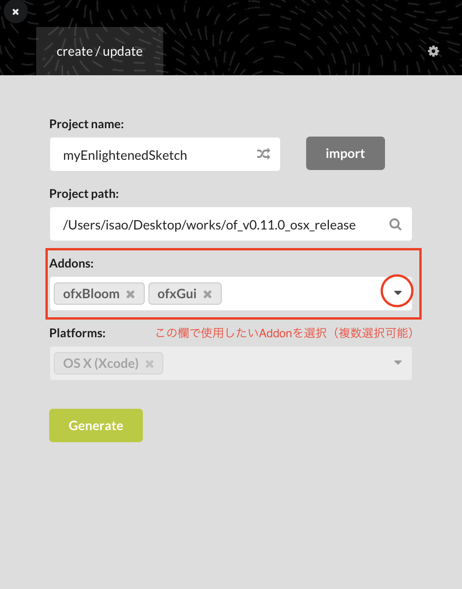
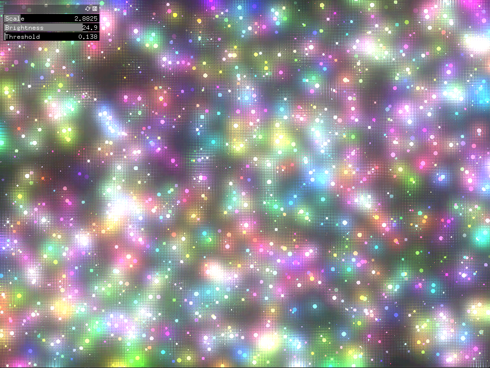
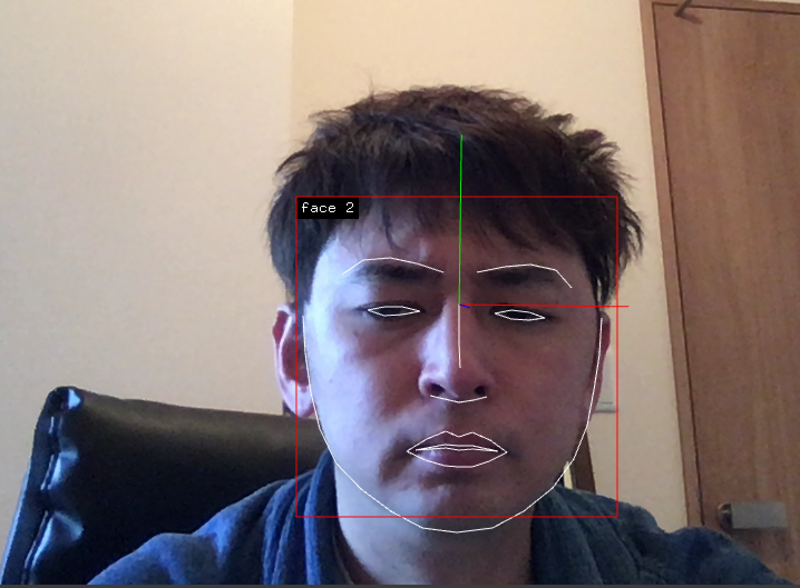

# Addonの使い方

Addon(アドオン)とは、openFrameworksに機能を拡張するためのライブラリー<br>
デフォルトで付属されているアドオン<br>

- ofx3DModelLoader : 3Dモデルを読み込み
- ofxOpenCv : OpenCVを活用したコンピュータビジョン(画像分割、領域結合、輪郭検出)
- ofxOsc : Open Sound Control（OSC）で外部のアプリケーションと通信
- ofxGui : プロジェクトにGUIに追加
- ofxKinect : Kinectからの情報を取得
- ofxXmlSettings : アプリケーションの設定を、XML形式で保存
- ofxSvg : SVG（Scalable Vector Graphics）を扱う などがある<br><br>


参考: ofxaddons.com
https://ofxaddons.com/categories  <br>


## Addonを使ったプロジェクの設定方法


<br>
↓ <br>
ofApp.hの先頭に（ #include "ofxGui.h" ）のように読み込む(詳しくはサンプルソースにて)<br>


<br><br>

## ofxBloom
描画した物体を簡単に発光させれるAddon。<br>
Bloomは「咲く」という意味の言葉で、光の花が咲いているような表現ができます。<br>
公式ページ:https://github.com/P-A-N/ofxBloom



<br><br>


ofApp.h
```

#pragma once

#include "ofMain.h"

// Addonの読み込み
#include "ofxBloom.h"
#include "ofxGui.h"

class ofApp : public ofBaseApp{

	public:
		void setup();
		void update();
		void draw();
    
        // Addonで使う変数
        // ofxGui系
        ofxPanel gui;
        ofxFloatSlider scale;
        ofxFloatSlider thresh;
        ofxFloatSlider brightness;

        // ofxBloom系
        ofxBloom bloom;
        ofFbo fbo;

        // Particleの設定
        static const int NUM = 2000;
        float posX[NUM];
        float posY[NUM];
        float speedX[NUM];
        float speedY[NUM];
        float diameter[NUM];
        ofColor hue[NUM];
    
		
};
```


ofApp.cpp
```

#include "ofApp.h"

//--------------------------------------------------------------
void ofApp::setup(){
    
    
    
    
    // 座標正規化
    ofDisableArbTex();
    // fboの領域を確保する
        fbo.allocate(ofGetWidth(), ofGetHeight());
    ofEnableArbTex();
    
    bloom.setup(ofGetWidth(), ofGetHeight(), fbo);

    // ofxGuiの設定
    gui.setup();
    gui.add(scale.setup("Scale", 2.3f, 0.1f, 16.f));
    gui.add(brightness.setup("Brightness", 5.0f, 0.f, 30.f));
    gui.add(thresh.setup("Threshold", 0.f, 0.1f, 2.f));
    
    
    
    // ランダムなパーティクルを初期化
    for(int i=0; i<NUM; i+=1){
      posX[i] = ofRandom(ofGetWidth());
      posY[i] = ofRandom(ofGetHeight());
      speedX[i] = ofRandom(-5,5);
      speedY[i] = ofRandom(-5,5);
      diameter[i] = ofRandom(5);
      hue[i] = ofColor(ofRandom(255), ofRandom(255), ofRandom(255));
    }
    
    
    
}

//--------------------------------------------------------------
void ofApp::update(){


    
    
    // パーティクルの
    for(int i=0; i<NUM; i++){
      //XYの座標にスピードを足す
      posX[i] = posX[i] + speedX[i];
      posY[i] = posY[i] + speedY[i];
      //跳ね返り
      if(posX[i] > ofGetWidth() || posX[i] <0){
        speedX[i] = speedX[i] * -1;
      }
      if(posY[i] > ofGetHeight() || posY[i] <0){
        speedY[i] = speedY[i] * -1;
      }
    }

    
    

}

//--------------------------------------------------------------
void ofApp::draw(){
    
    fbo.begin();
        // クリアする
        ofClear(0);
        
        // パーティクルの描画
        for(int i=0; i<NUM; i++){
            ofSetColor(hue[i]);
            ofDrawCircle(posX[i],posY[i],diameter[i],diameter[i]);
        }
        
    fbo.end();
    
    // bloomに値を適用
    bloom.setBrightness(brightness);
    bloom.setScale(scale);
    bloom.setThreshold(thresh);
    bloom.process();

    
    bloom.draw();
    gui.draw();

}

```


## ofxFaceTracker2
コンピュータビジョン (CV) と機械学習による顔のパーツを立体的にトラッキングする技術、<br>
Face Tracking が活用されています。簡易版snow

<br>




- ofxOpenCvとofxCvが必要
- bin/data/ に shape_predictor_68_face_landmarks.dat 格納
- https://sourceforge.net/projects/dclib/


ofApp.h
```
#pragma once

#include "ofMain.h"
#include "ofxFaceTracker2.h"

class ofApp : public ofBaseApp{

	public:
		void setup();
		void update();
		void draw();

        // faceTrackerのインスタンス
        ofxFaceTracker2 tracker;
    
        // カメラ動画保存用
        ofVideoGrabber grabber;
		
};

```


ofApp.cpp
```

#include "ofApp.h"

//--------------------------------------------------------------
void ofApp::setup(){
    
    // カメラ動画保存用のセットアップ
    grabber.setup(1280,720);
        
    // faceTrackerのセットアップ
    tracker.setup();
}

//--------------------------------------------------------------
void ofApp::update(){
    
    // 動画フレームのアップデート
    grabber.update();
    
    // フレームの内容が変化していたらfaceTrackerを更新
    if(grabber.isFrameNew()){
        tracker.update(grabber);
    }
    
}

//--------------------------------------------------------------
void ofApp::draw(){
    
        // カメラ画像を表示
        grabber.draw(0, 0);
        
        // 顔の輪郭線を表示
        tracker.drawDebug();
        
        // 軸を表示
        tracker.drawDebugPose();
}
```
