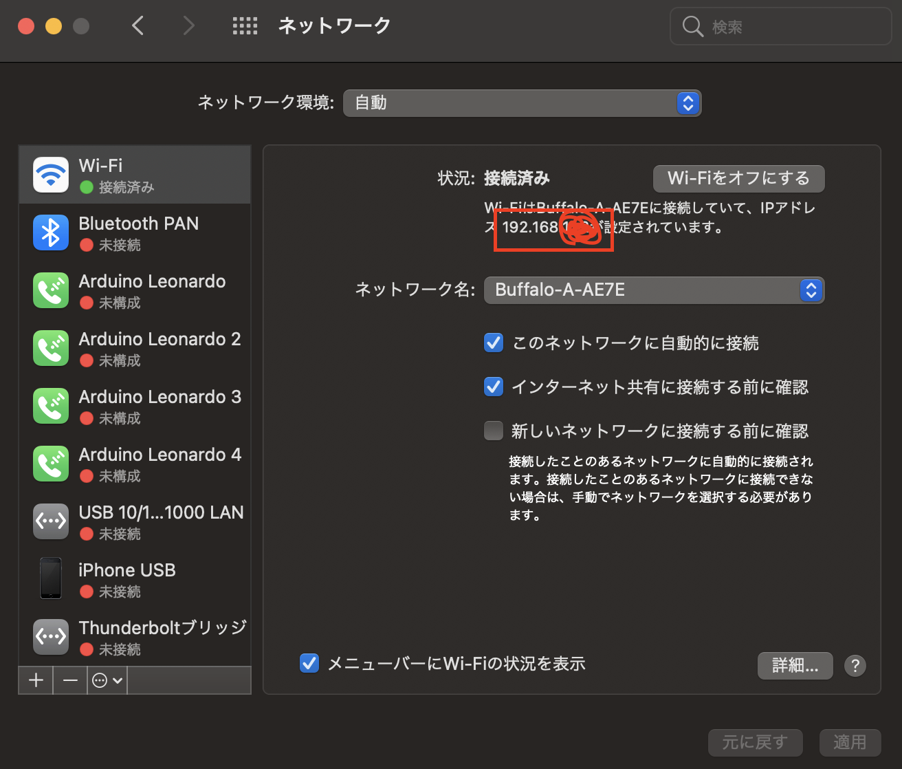
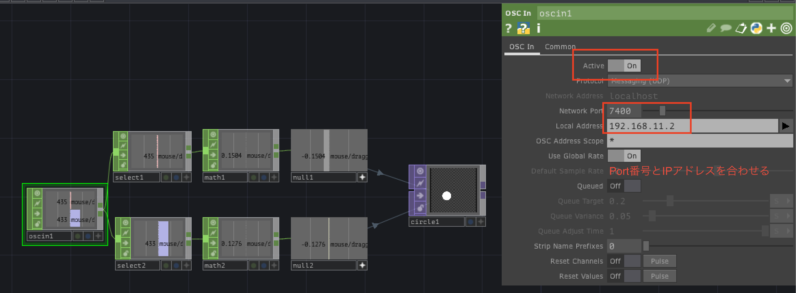
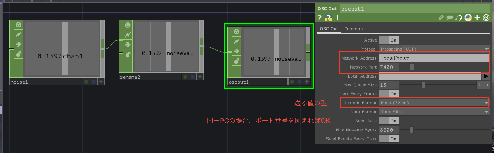
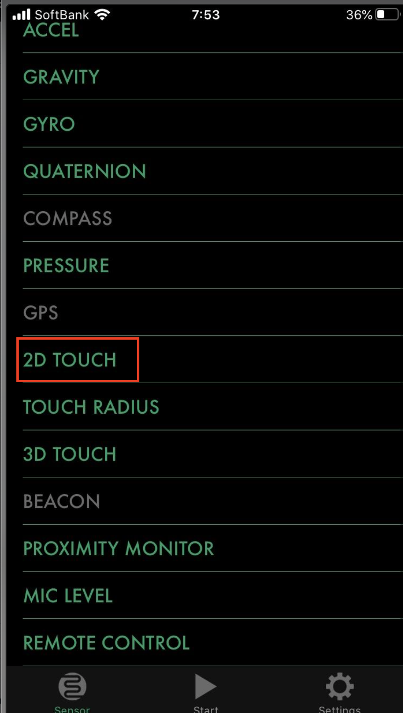
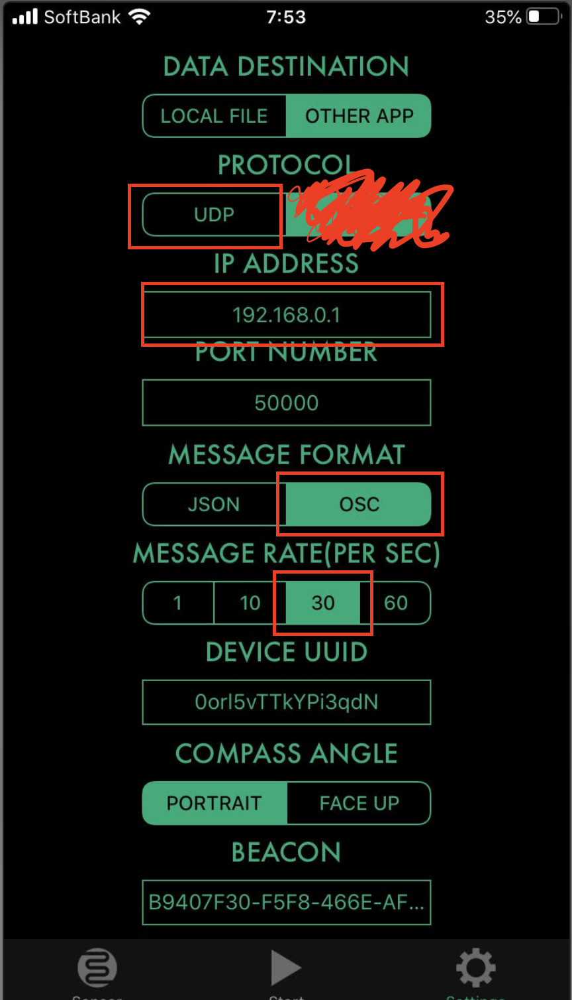
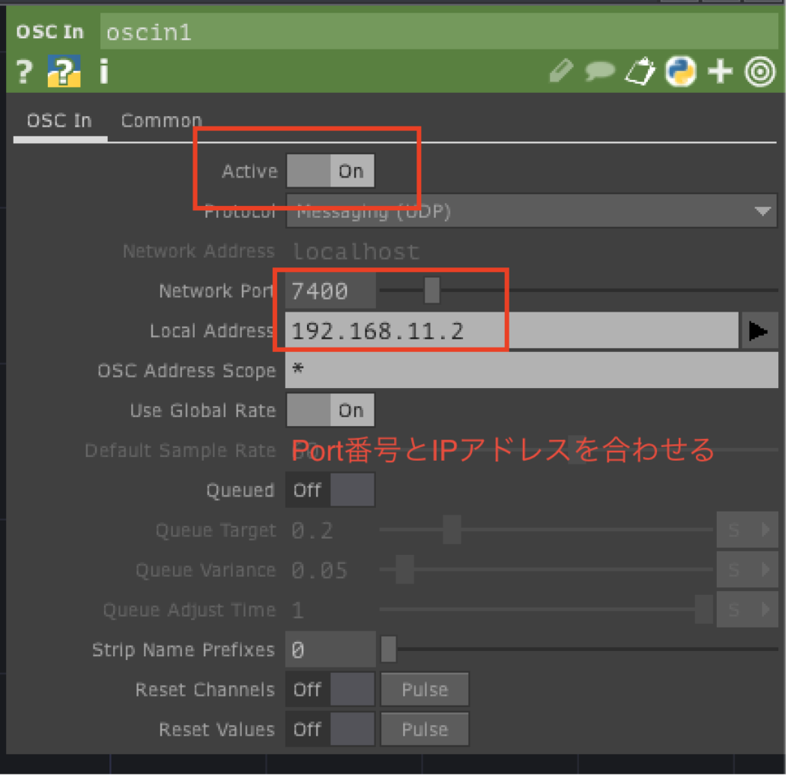

# ofxOSC

## OSCとは

OpenSound Control（OSC）とは、電子楽器（特にシンセサイザー）やコンピュータなどの機器において音楽演奏データをネットワーク経由でリアルタイムに共有するための通信プロトコルである。([Wikipedia](https://ja.wikipedia.org/wiki/OpenSound_Control))


対応アプリケーションは多数あり、リアルタイムに同期で可能です。<br>
アプリケーション間で仕事を分担したり、PC間で負荷を分担する際に通信を行うことでインスタレーションやオーディオ、映像の連携でよく利用されています。<br>

&nbsp;

## OSCの設定

#### ネットワークアドレスの確認


<br>


## ofxOscの使い方


### OSCの送信側のコード
IPアドレス、ポート番号、アドレスの指定が必要 <br>
```
// ofApp.h

#pragma once

#include "ofMain.h"
#include "ofxOsc.h" //インクルード

class ofApp : public ofBaseApp{

	public:
		void setup();
		void update();
		void draw();

		void mouseDragged(int x, int y, int button);
		
    	   // ポート番号
	   static const int PORT = 7400;
	   // Osc送信用のインスタンス変数
	   ofxOscSender sender;
};

```

```
//ofApp.opp

#include "ofApp.h"

void ofApp::setup(){
    ofSetFrameRate(60);
    ofBackground(0);
    
    // Osc送信のセットアップ
    sender.setup("127.0.0.1", PORT);
}
void ofApp::update(){
	
}
void ofApp::draw(){
	
}
void ofApp::mouseDragged(int x, int y, int button){
    // OSCで送信するデータの作成
    ofxOscMessage msg;
    
    // アドレスを設定
    msg.setAddress("/mouse/dragged");
    
    // ドラッグしたX座標
    msg.addIntArg(x);
    // ドラッグしたY座標
    msg.addIntArg(y);
    
    // OSC送信
    sender.sendMessage(msg);   
}
```

&nbsp;


### OSCの受信側のコード

同じポート番号を指定、送信側と同じ識別子 `/trigger/xxx/` を記述でデータを受け取る

```
// ofApp.h

#pragma once

#include "ofMain.h"
#include "ofxOsc.h" //インクルード

class ofApp : public ofBaseApp{

	public:
		void setup();
		void update();
		void draw();
		
		//受信するポート番号
		static const int PORT = 7400;
    
	    //OSCのレシーバー
	    ofxOscReceiver receiver;
	    
	    // OSCで受信した座標を保存する
	    ofVec2f pos;
};

```

```
//ofApp.opp
#include "ofApp.h"

void ofApp::setup(){
    ofSetFrameRate(60);
    ofBackground(0);
    
    // Osc受信のセットアップ
    receiver.setup(PORT);
}

void ofApp::update(){
    //OSCデータの受信待ち
    while(receiver.hasWaitingMessages()){
        //受信用のインスタンス変数
        ofxOscMessage msg;
        receiver.getNextMessage(msg);
        
        //受信側の識別子と同じ条件で
        if(msg.getAddress() == "/mouse/dragged"){
            pos.x = msg.getArgAsInt(0);
            pos.y = msg.getArgAsInt(1);
        }
    }
}


void ofApp::draw(){
    ofSetColor(255, 0, 0);
    ofDrawCircle(pos.x, pos.y, 20);
}

```

# ofxOscを使ってTouchDesignerとデータの連携
## データを受信


ofApp.h
```
// ofApp.h

#pragma once

#include "ofMain.h"
#include "ofxOsc.h" //インクルード

class ofApp : public ofBaseApp{

    public:
        void setup();
        void update();
        void draw();
        void mouseDragged(int x, int y, int button);
    
           // ポート番号
           static const int PORT = 7400;
        
           // Osc送信用のインスタンス変数
           ofxOscSender sender;
};

```

ofApp.cpp
```
#include "ofApp.h"

//ofApp.opp
void ofApp::setup(){
    ofSetFrameRate(60);
    ofBackground(0);
    
    // Osc送信のセットアップ
    sender.setup("10.1.155.34", PORT);
}
void ofApp::update(){


}
void ofApp::draw(){
    
}
void ofApp::mouseDragged(int x, int y, int button){
    // OSCで送信するデータの作成
    ofxOscMessage msg;
    
    // アドレスを設定
    msg.setAddress("/mouse");
    
    // ドラッグしたX座標
    msg.addIntArg(x);
    // ドラッグしたY座標
    msg.addIntArg(y);
    
    // OSC送信
    sender.sendMessage(msg);
}

```

## データを送信



ofApp.h
```
// ofApp.h

#pragma once

#include "ofMain.h"
#include "ofxOsc.h" //インクルード

class ofApp : public ofBaseApp{

    public:
        void setup();
        void update();
        void draw();
        // ポート番号
        static const int PORT = 7400;
    
        //OSCのレシーバー
        ofxOscReceiver receiver;
        
        // OSCで受信した値
        float receiveVal;
    
    };


```

```

#include "ofApp.h"

//ofApp.opp
void ofApp::setup(){
    ofSetFrameRate(60);
    ofBackground(0);
    
    receiver.setup(PORT);
}
void ofApp::update(){
    
    
    //OSCデータの受信待ち
    while(receiver.hasWaitingMessages()){
        
        //受信用のインスタンス変数
        ofxOscMessage msg;
        receiver.getNextMessage(msg);
        
        
        if(msg.getAddress()== "/noiseVal") {
            receiveVal= msg.getArgAsFloat(0);
        }
        
    }
    
}
void ofApp::draw(){
    ofSetColor(255);
    ofDrawCircle(ofGetWidth()/2, ofGetHeight()/2, receiveVal * 100);
}


```


# ZIGSIMで連携

## ZIGSIM設定
<br>

## tdと連携 (oscin chop を使用)


## openFrameworksと連携

ofApp.h
```
#pragma once

#include "ofMain.h"
#include "ofxOsc.h" //インクルード

class ofApp : public ofBaseApp{

	public:
		void setup();
		void update();
		void draw();

       // ポート番号
       static const int PORT = 50000;

    
        //OSCのレシーバー
        ofxOscReceiver receiver;
        
        // OSCで受信した値
        float receiveVal;
        
        // 描画する円のポジション
        glm::vec2 pos;
};

```


ofApp.cpp
```

#include "ofApp.h"

//--------------------------------------------------------------
void ofApp::setup(){
    
    ofSetFrameRate(60);
    ofBackground(0);
    
    receiver.setup(PORT);

}

//--------------------------------------------------------------
void ofApp::update(){
    
    //OSCデータの受信待ち
    while(receiver.hasWaitingMessages()){
        
        //受信用のインスタンス変数
        ofxOscMessage msg;
        receiver.getNextMessage(msg);
        
        
        if(msg.getAddress()== "/ZIGSIM/0orl5vTTkYPi3qdN/touch0") {
            float val1 = msg.getArgAsFloat(0);
            float val2 = msg.getArgAsFloat(1);
            
            // map関数で値調整
            float mapVal1 = ofMap(val1, -1, 1, 0, ofGetWidth());
            float mapVal2 = ofMap(val2, -1, 1, 0, ofGetHeight());
            cout << "" << mapVal1 << endl;
            cout << "mapVal2" << mapVal1 << endl;
            
            pos.x = mapVal1;
            pos.y = mapVal2;
        }
        
    }

}

//--------------------------------------------------------------
void ofApp::draw(){
    
     ofSetColor(255);
     ofDrawCircle(pos.x, pos.y, 10);

}


```


