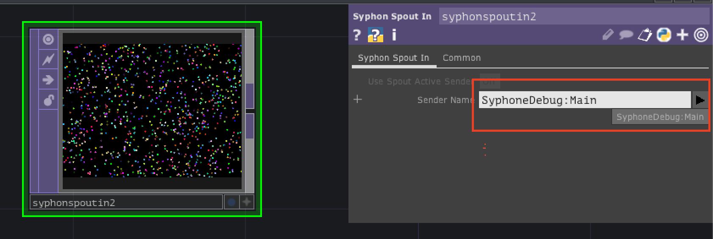

# ofxSyphonでTouchDesignerに映像を送る

## Syphonとは


>SyphonはオープンソースのMac OS Xテクノロジーで、
>アプリケーションはフルフレームレートのビデオや静止画をリアルタイムで
>相互に共有できます。 
>今では、ジョブの各部分に最適なツールを使用して、
>イメージをミックス、マッシュ、編集、サンプル、テクスチャマップ、合成、
>および提示するための多彩なツールの表現力を活用できます。 
>Syphonは、シングルアプリケーションソリューションから抜け出し、
>ニーズに合わせてクリエイティブアプリケーションを組み合わせる柔軟性を提供します。

http://syphon.v002.info/  より


### ofxSyphonの使い方


ofxSyphone公式リポジトリ
https://github.com/astellato/ofxSyphon

ProjectGenaratorでofxSyphonを追加。

ofApp.h
```
#pragma once

#include "ofMain.h"
#include "ofxSyphon.h"

class ofApp : public ofBaseApp{
	public:
		void setup();
		void update();
		void draw();
    
        // Syphonで送るようのインスタンス
        ofxSyphonServer output;
};
```

ofApp.cpp
```
#include "ofApp.h"


void ofApp::setup(){
    // ラベルに名前をつける
    output.setName("Main");
}

void ofApp::update(){

}

void ofApp::draw(){
    
    // 描画
    ofSetColor(255,0,0);
    ofDrawCircle(ofGetWidth()/2, ofGetHeight()/2, 100);

    //ここで送信している(drawの最後に記述)
    output.publishScreen();
}

```


### oFで作ったパーティクルをTouchに送って発光させてみる。


こちらを目指しましょう。<br>
<br>
基本はこちらのオペレーターの繋ぎ方<br>


パーティクルのコード<br>

ofApp.h
```
#pragma once

#include "ofMain.h"
#include "ofxSyphon.h"


class ofApp : public ofBaseApp{

	public:
		void setup();
		void update();
		void draw();
    
        // Syphonで送るようのインスタンス
        ofxSyphonServer output;

        static const int NUM = 1000;
        
        // ポジション定義
        float posX[NUM];
        float posY[NUM];
        
        // スピード定義
        float speedX[NUM];
        float speedY[NUM];
    
        // カラー
        int r[NUM];
        int g[NUM];
        int b[NUM];
        
};

```


ofApp.cpp
```

#include "ofApp.h"

//--------------------------------------------------------------
void ofApp::setup(){
    
    // ラベルに名前をつける
    output.setName("Main");
    
    //円の角の数(円を滑らかにする)
    ofSetCircleResolution(64);
    
    // フレームレート60に
    ofSetFrameRate(60);
    
    // 背景黒
    ofBackground(0);
    
    // アルファ使用可能に
    ofEnableAlphaBlending();
    
    // 初期値セット
    for (int i=0; i<NUM; i++) {
        posX[i] = ofRandom(0,ofGetWidth()); // ofGetWidth 画面横幅取得
        posY[i] = ofRandom(0,ofGetHeight()); // ofGetHeight 画面縦幅取得
        speedX[i] = ofRandom(-10, 10);
        speedY[i] = ofRandom(-10, 10);
        r[i] = ofRandom(256);
        g[i] = ofRandom(256);
        b[i] = ofRandom(256);
    }
    
}

//--------------------------------------------------------------
void ofApp::update(){
    // updateで位置の更新などの計算
    for (int i=0; i<NUM; i++) {
        posX[i] = posX[i] + speedX[i];
        posY[i] = posY[i] + speedY[i];
        
        if(posX[i] > ofGetWidth() || posX[i] < 0 ){
            speedX[i] = speedX[i] * -1;
        }
        
        if(posY[i] > ofGetHeight() || posY[i] < 0 ){
            speedY[i] = speedY[i] * -1;
        }
    }
}

//--------------------------------------------------------------
void ofApp::draw(){

    
    // 描画
    for (int i = 0; i<NUM; i++) {
        ofSetColor(r[i], g[i], b[i]);
        ofDrawCircle(posX[i], posY[i], 5);
    }
    
    //ここで送信している
    output.publishScreen();
}

```



「Syphon Spout In」TOPで受け取って、「blur TOP」 や 「Level TOP」などを
使って発光させて見ましょう！ 
