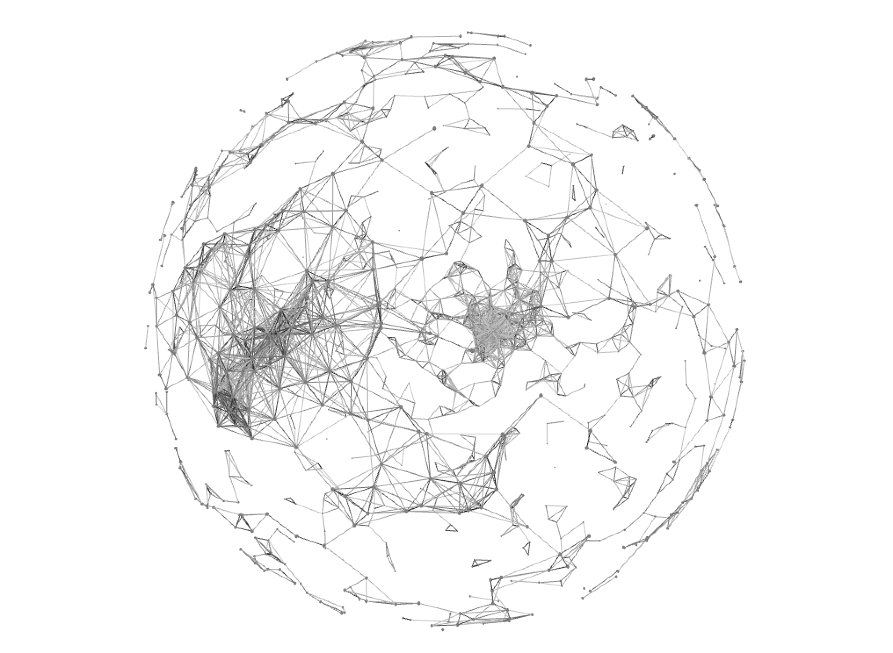

## 球面座標のアニメーションプログラミング



PointSphere.hpp
```
#pragma once
#include "ofMain.h"

class PointSphere{
public:
    //コンストラクタ
    PointSphere();
    //メソッド
    void setup();
    void update();
    void draw();
    
    //プロパティ
    //座標
    ofVec3f pos;
    //目的座標
    ofVec3f targetPos;
    //半径
    float radius;
    //イージング
    float easing = 0.05;

};

#endif /* PointSphere_hpp */
```

PointSphere.cpp
```

#include "PointSphere.hpp"

PointSphere::PointSphere(){
    //球の半径の初期値
    radius = 300.0;
    //初期座標
    pos.set(0,0,0);
    //目的地の初期座標
    targetPos.set(0,0,0);
    //最初のアニメーション
    setup();
}

void PointSphere::setup(){
    //球面座標のランダム角度θとφ
    float randTheta = ofRandom(360);
    float randPhi = ofRandom(180);
    //球面座標のXYZ
    targetPos.x = radius * sin(ofDegToRad(randTheta)) * cos(ofDegToRad(randPhi));
    targetPos.y = radius * sin(ofDegToRad(randTheta)) * sin(ofDegToRad(randPhi));
    targetPos.z = radius * cos(ofDegToRad(randTheta));
}

void PointSphere::update(){
    //イージング
    ofVec3f distance; //2点間の距離
    distance = targetPos - pos;
    pos = pos + distance * easing;
}

void PointSphere::draw(){
    ofSetColor(127);
    ofDrawSphere(pos.x, pos.y, pos.z,1.0);
}

```

ofApp.h
```
#pragma once

#include "ofMain.h"
#include "PointSphere.hpp"

class ofApp : public ofBaseApp{

	public:
		void setup();
		void update();
		void draw();
    //カメラ
    ofEasyCam cam;
    
    //配列の数
    static const int NUM = 500;
    //ポイントの座標
    ofVec3f pos[NUM];
    //クラスのポインタ変数
    PointSphere* point[NUM];
};

```


ofApp.cpp
```

#include "ofApp.h"

//--------------------------------------------------------------
void ofApp::setup(){
    
    
    ofSetFrameRate(60);
    ofBackground(0);
    ofEnableDepthTest();//深度
    
    for(int i=0; i<NUM; i++){
        //インスタンスの宣言
        point[i] = new PointSphere();
    }
    
}

//--------------------------------------------------------------
void ofApp::update(){
    
    //値の更新
    for(int i=0; i<NUM; i++){
        
        if(ofGetFrameNum() % 120 == 0){
            //2秒に1回
            point[i]->setup();
        }
        point[i]->update();
    }
}

//--------------------------------------------------------------
void ofApp::draw(){

    cam.begin();
    ofDrawAxis(1000);
    
    //Y軸回転
    ofRotateYRad(ofGetFrameNum() * 0.005);
    
    //描画
    for(int i=0; i<NUM; i++){
        point[i]->draw();
    }
    
    //ポイント同士の距離を測って線で結ぶ
    //2重ループで測る
    for (int j=0; j<NUM; j++) {
        for(int i=0; i<NUM; i++){
            float d = ofDist(point[j]->pos.x, point[j]->pos.y, point[j]->pos.z, point[i]->pos.x, point[i]->pos.y, point[i]->pos.z);
            if(d < 40){
                ofSetColor(255,120);
                ofDrawLine(point[j]->pos.x, point[j]->pos.y, point[j]->pos.z, point[i]->pos.x, point[i]->pos.y, point[i]->pos.z);
            }
        }
    }
    cam.end();
}

```

